<div align="center">

# 🥔 AluChop

### Restaurant Management System

**A desktop point-of-sale and back-office system for a multi-cuisine restaurant in Kathmandu**

C++17 · Qt 6 Widgets · SQLite · CMake + Ninja

*ENCT151 — Object-Oriented Programming coursework*

</div>

---

## Overview

**AluChop** is a complete, single-binary restaurant management system: a waiter opens a table,
builds an order, fires it to the kitchen, watches it move down the pass, serves it — at which point
the store room is debited from the dish's recipe automatically — then raises the bill, applies a
promo, takes cash and prints the receipt. Managers get staff, stock, reservations, reports and
backups behind the same sidebar.

It is written as OOP coursework, so the design is deliberately explicit: five namespaces with a
strict one-way dependency rule, a virtual-base diamond that solves a real problem, operator
overloading only where the domain genuinely means it, a class template at the persistence boundary,
a custom exception hierarchy, and a raw `<fstream>` layer sitting alongside SQLite because "read,
write, append, binary, random access" is a syllabus requirement that a database does not satisfy.

Every price in the system is **NPR, tax-inclusive**. No code path adds tax on top of a menu price.
Money is a value type over integer paisa — **no `double` ever holds currency**, at any layer, not
even in transit.

| | |
|---|---|
| **Language** | C++17 (Apple clang 17) |
| **GUI** | Qt 6.11.1 Widgets, Charts, Svg, PrintSupport |
| **Database** | SQLite via the Qt SQL `QSQLITE` driver — 17 tables |
| **Build** | CMake ≥ 3.20 + Ninja · builds clean with **0 errors, 0 warnings** under `-Wall -Wextra` |
| **Size** | 85 headers, 77 sources, ~32,500 lines |
| **Seeded content** | 126 menu items across 14 categories, 157 ingredients, 580 recipe lines, 6 suppliers, 12 tables, 7 staff, 6 customers, 2 promos |

---

## Features

### 🔐 Authentication
- Salted **SHA-256** password storage (`pass_hash` + per-user random `salt` columns) — plaintext is never written, anywhere
- Admin and employee login with four roles: `Admin`, `Manager`, `Waiter`, `Chef`
- **Remember me on this device** — a persistent token signs you straight back in and skips the login window
- **Forgot password** — three-step recovery through a per-account security question; a reset also invalidates any remembered session
- Change own password; Admin-only account creation, enforced **in the service** so no caller can bypass it
- `hasRole(atLeast)` rank test — see the [honest enforcement note](docs/USE_CASE.md#5-honest-note--what-is-actually-enforced-in-code)

### 📊 Dashboard
- Four animated statistic cards: today's sales, pending orders, customer count, low-stock items
- Seven-day revenue bar chart (QtCharts)
- Live alert list: low stock, ingredients expiring soon, today's reservations
- Pending-orders table and a best-sellers list
- Cards fade and slide in on load via `QPropertyAnimation`

### 🍽 Menu
- All 14 required categories populated: Sushi · Pizza · Pasta · Main Course · Dimsum · From the Tandoor · From the Wok · Bread & Rice · Dessert · Drinks · Beer · Wine · Mocktails · Shots — **9 dishes each, 126 total**
- Search, filter by category, sort by name or price, availability toggle
- Full item CRUD plus per-dish **recipe editing** (the link that drives inventory)
- Prices, descriptions, availability flag and an optional image path per item

### 🧾 Orders
- **Dine-In / Takeaway / Delivery**; dine-in validates that the table exists and is in service
- Order numbers `ORD-YYYYMMDD-NNN`, unique by constraint
- Add, edit quantity and remove lines; the same dish merges into one line
- **Split a bill** — implemented with `Order`'s copy constructor; the copy is a genuinely new, unsaved order and both writes land in one transaction
- **Merge bills** — implemented with `Order::operator+=`; the absorbed order is cancelled and stamped `merged_into`, never deleted, so the audit trail can still explain it
- Kitchen board and a FIFO `KitchenQueue` over `std::queue`
- Status ladder `OPEN → PENDING → PREPARING → READY → SERVED → PAID`, enforced by a transition table **inside the model**, not the UI

### 👥 Customers
- Phone-keyed customer book with search over name, phone and email
- Loyalty points — **1 point per whole Rs 100 actually paid**, credited inside the payment transaction
- Visit counter incremented by `operator++` when an order reaches `SERVED` (visits and points are credited at different moments, on purpose, so nothing is double-counted)
- Order history and computed favourite items per customer

### 🧑‍🍳 Employees
- Roster with position, shift, salary, hire date, performance rating (1–5) and an active flag
- **Polymorphic payroll**: `Waiter` = salary + tips, `Chef` = salary + overtime × Rs 300/hr, `Manager` = salary + bonus, all dispatched through one virtual `monthlyPay()` on objects whose concrete type came from a database string
- Attendance marking (`PRESENT` / `ABSENT` / `LEAVE`, one row per person per day) and a monthly sheet
- Payroll preview table
- **Role-gated**: below Manager the screen degrades to a read-only roster

### 📦 Inventory
- 157 ingredients with unit, stock, reorder threshold, expiry date, unit cost and supplier
- **Automatic recipe-driven deduction** when an order is served — plan, check, then apply in one transaction; never a half-deduction
- Restock, waste and adjustment, each writing an `inventory_transactions` row
- Low-stock and expiry alerts, raised as toasts and shown on the dashboard
- Supplier management
- Per-ingredient movement history

### 📅 Reservations
- Book a table by date, time, duration, party size and special request
- **Availability is computed, not guessed**: candidate tables are filtered by capacity, then blocked tables are removed with the erase-remove idiom over real overlap queries
- Seat, complete, cancel and no-show

### 💰 Billing
- Bill snapshots the lines and the subtotal, so re-pricing the menu afterwards cannot change what the guest owes
- Promo codes (`PERCENT` and `FLAT`, with validity window and minimum order) — two ship seeded: `WELCOME10` and `FLAT100`
- Staff discount (10 %) resolved through the `StaffCustomer` fusion
- Discounts are **compared, never stacked** — the larger wins, and a tie keeps the promo the guest asked for
- Configurable service charge, applied **after** the discount
- **`total = subtotal − discount + serviceCharge`. There is no tax term anywhere.**
- Cash / Card / Digital Wallet; change calculated for cash and the *Take payment* button stays disabled until the tender covers the total
- Receipt as text, as a print job (`QPrinter`) or as a PDF (`QPdfWriter`)

### 📈 Reports
- Five report kinds: Sales, Inventory, Orders, Customers, Employees
- QtCharts bar chart per report kind, date-ranged
- Preview table showing **exactly** the rows the export will contain
- **CSV export** through the raw `<fstream>` `CsvWriter`, and **PDF export** through `QPdfWriter`
- **Audit-trail integrity check** — walks the 128-byte binary records and reports the first bad checksum or sequence break

### ⚙️ Settings
- Restaurant name, address and phone (these appear on receipts and reports)
- Light / Dark theme, persisted and applied at next launch
- Timestamped database **backup**, validated **restore** (the file's SQLite header magic is checked before it is swapped in) and "export everything" to CSV

### ✨ Extras
- **Dark mode** derived from the same sage hues — deep desaturated green-greys, never pure black
- **Command palette** (`Ctrl+K`) — fuzzy subsequence search across menu items, customers, active orders and page navigation
- **Undo / redo** — a real Command hierarchy, 50 deep, going back through the services so the reversal is durable and audited, not just an in-memory rollback
- **Toast notifications** — four levels, max four visible, auto-dismissing
- **Splash screen** — `QPropertyAnimation` fade-in, hold while the database opens and seeds, fade-out, then hand over to login
- Keyboard shortcuts: `Ctrl+K` palette · `Ctrl+Z` / `Ctrl+Shift+Z` undo-redo · `Ctrl+T` theme · `Ctrl+1`…`Ctrl+9` jump to page · `Ctrl+N` new order · `F5` refresh
  *(`Ctrl` is Qt's portable modifier name — on macOS these resolve to the ⌘ key.)*
- Icons are rendered as **theme-tinted SVG glyphs at runtime**, so they re-colour correctly in both palettes with no asset files to ship
- Append-mode text log, and a checksummed binary audit trail with a queryable SQL mirror

---

## Screenshots

> Generated by the `aluchop_uishot` target, which has the application grab its own widgets with
> `QWidget::grab()` — macOS refuses `screencapture` without a Screen Recording permission grant, so
> this is the only reliable way to capture the real UI.
>
> ```bash
> cmake --build build --target aluchop_uishot
> ./build/aluchop_uishot          # run from the project root: it writes to ./docs/screenshots
> ```
>
> Set `ALUCHOP_SHOT_DIR` to write somewhere else.

### Light theme — Sage Green

| | |
|:--:|:--:|
| 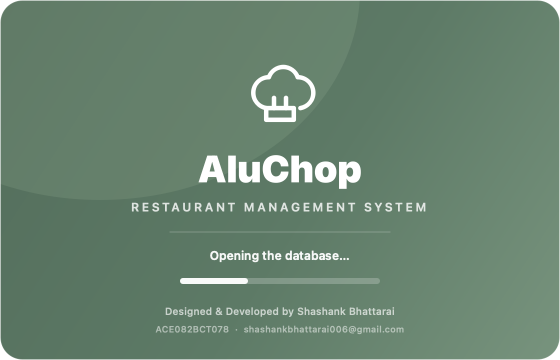 | 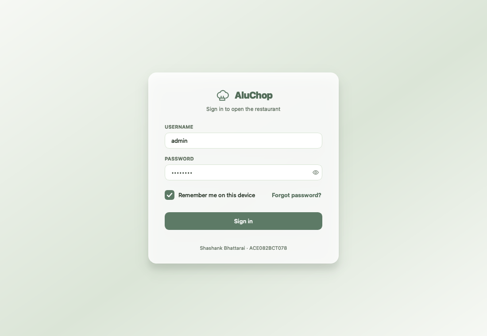 |
| **Splash** — branded fade-in while the database opens | **Login** — remember me and forgot-password |
| 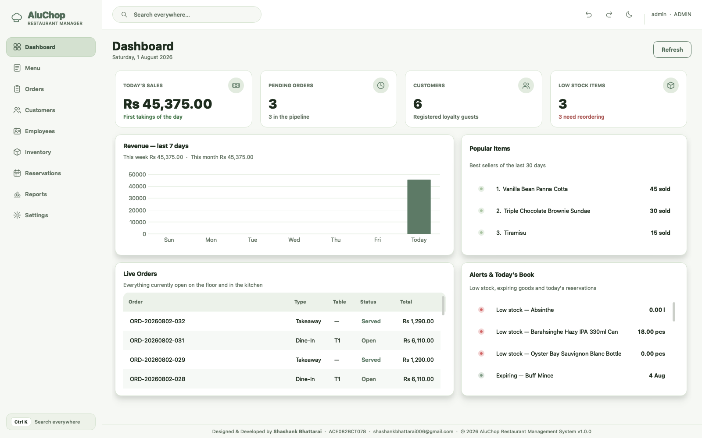 | 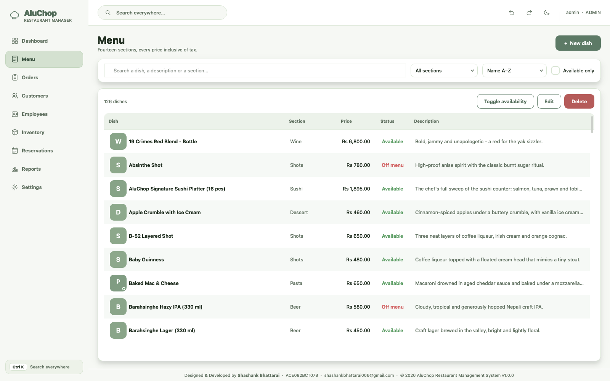 |
| **Dashboard** — animated stat cards, revenue chart, alerts | **Menu** — 126 dishes, search, filter, sort |
| 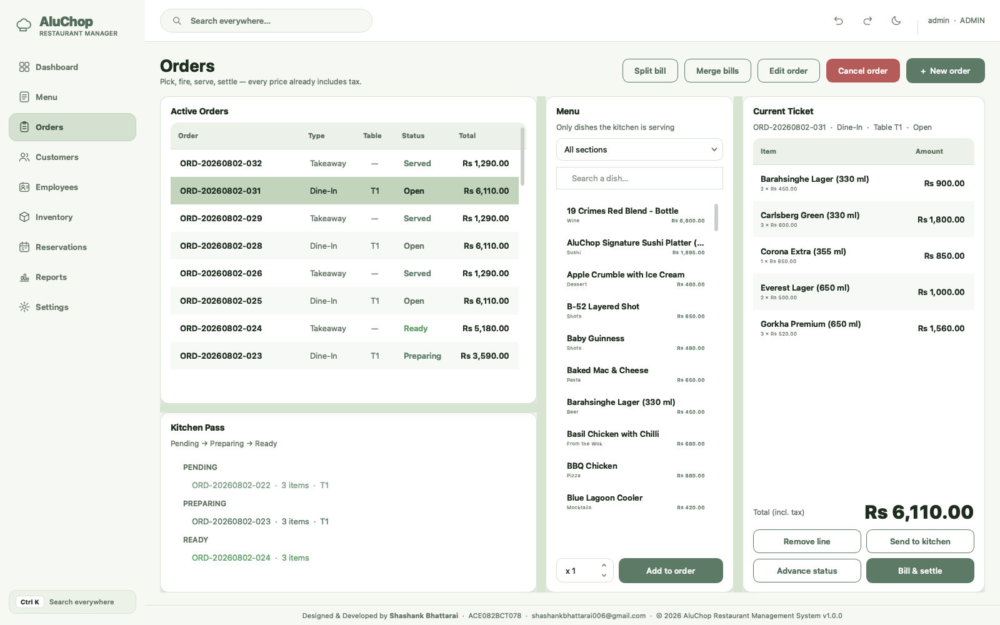 | 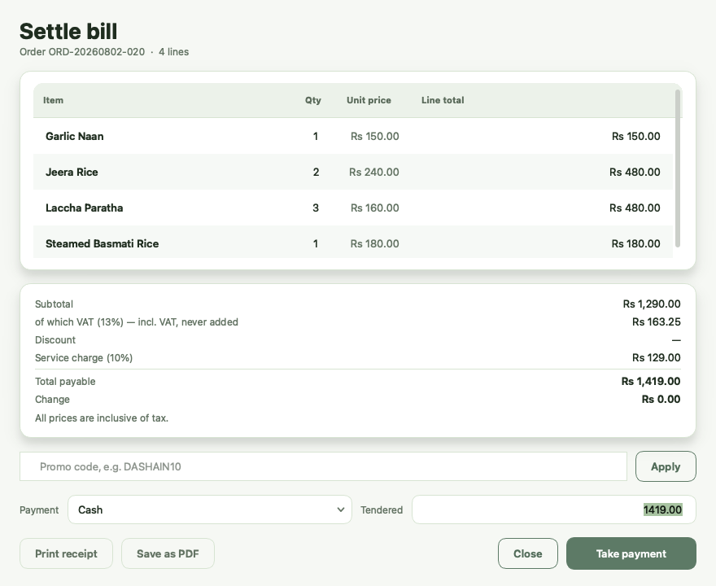 |
| **Orders / POS** — order list, kitchen board, line editor | **Billing** — promo, tender, change, receipt |
| 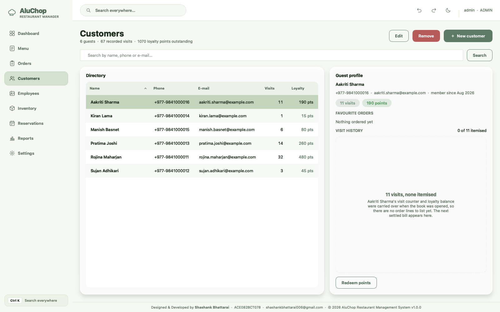 | 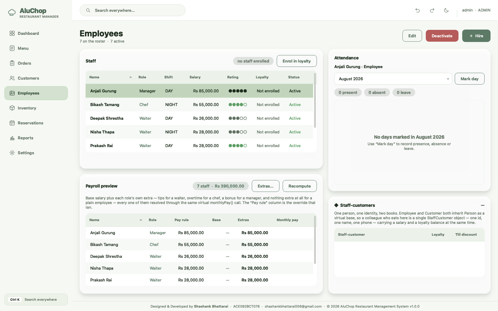 |
| **Customers** — loyalty, visits, history, favourites | **Employees** — roster, attendance, polymorphic payroll |
| 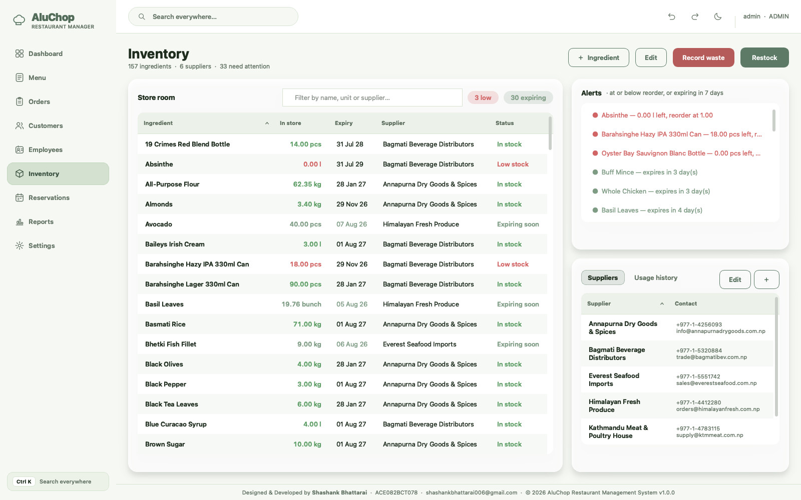 | 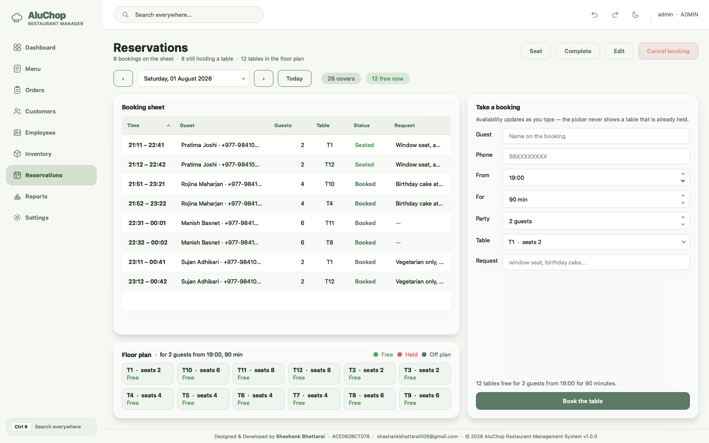 |
| **Inventory** — stock, suppliers, low-stock alerts | **Reservations** — availability, booking, seating |
| 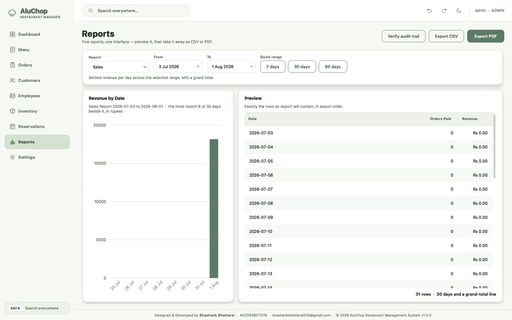 | 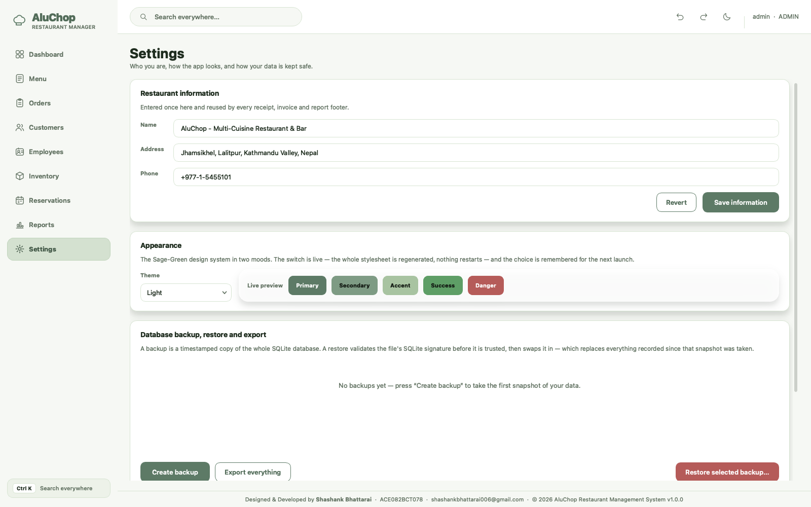 |
| **Reports** — charts plus CSV and PDF export | **Settings** — restaurant info, theme, backup, restore |
| 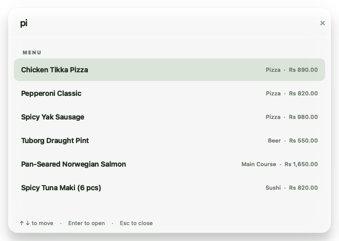 | |
| **Command palette** — `Ctrl+K`, search everything | |

### Dark theme

| | | |
|:--:|:--:|:--:|
| 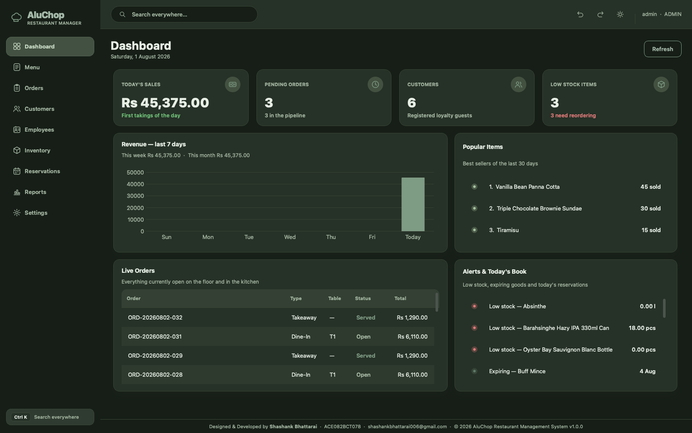 | 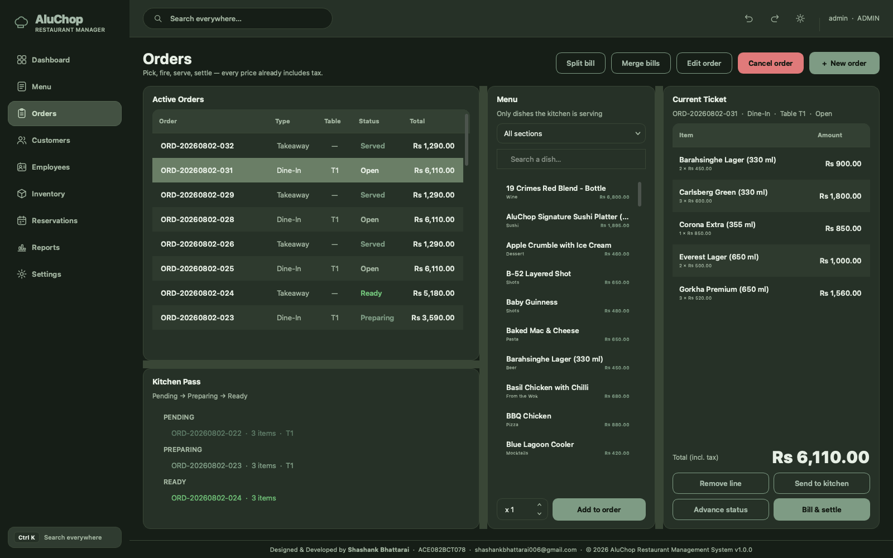 | 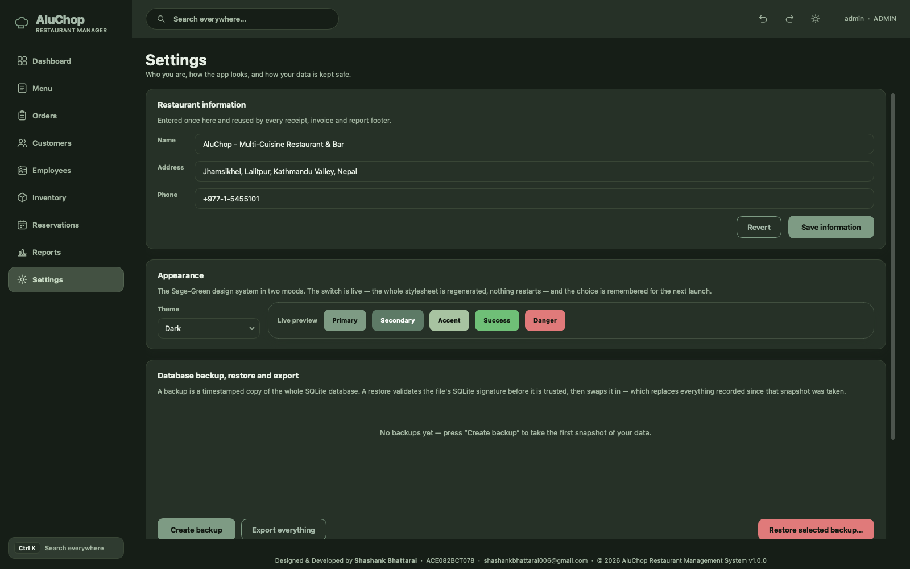 |
| **Dashboard** | **Orders / POS** | **Settings** |

---

## Installation

### Prerequisites

```bash
brew install cmake ninja qtbase qtcharts qtsvg qttools
```

Verified on macOS 15 (Darwin 24.6.0, Apple Silicon) with **Apple clang 17.0.0**, **CMake 4.3.3**,
**Ninja** and **Qt 6.11.1**.

### ⚠️ The Homebrew Qt gotcha — read this before you configure

Homebrew splits Qt 6 into **separate formulae**. `find_package(Qt6 COMPONENTS Charts …)` looks for
the add-on configs under *qtbase's* prefix and fails with:

```
Expected Config file at ".../qtbase/lib/cmake/Qt6Charts/Qt6ChartsConfig.cmake" does NOT exist
```

The fix is Qt's official override variable. **Note that it is `PACKAGES`, plural:**

```
QT_ADDITIONAL_PACKAGES_PREFIX_PATH     ✅ correct
QT_ADDITIONAL_PACKAGE_PREFIX_PATH      ❌ wrong — silently does nothing
```

The singular spelling is not an error and produces no warning; CMake simply ignores it and you get
the same failure again. This is the single most likely thing to cost you ten minutes on a fresh
machine.

### The exact, verified commands

```bash
git clone <repository-url> AluChop
cd AluChop

cmake -B build -G Ninja \
  -DCMAKE_PREFIX_PATH='/opt/homebrew/opt/qtbase' \
  -DQT_ADDITIONAL_PACKAGES_PREFIX_PATH='/opt/homebrew/opt/qtcharts;/opt/homebrew/opt/qtsvg;/opt/homebrew/opt/qttools'

cmake --build build

./build/AluChop
```

### Or just use the wrapper

`./build.sh` wraps exactly those commands, including the plural-`PACKAGES` variable, and
pre-flights that `cmake`, `ninja` and all four Qt prefixes are present before it starts.

```bash
./build.sh            # configure if needed, then build
./build.sh run        # build, then launch
./build.sh rebuild    # clean, configure, build
./build.sh clean      # delete build/
./build.sh help
```

### Checking one file without building the tree

Homebrew's Qt 6.11.1 is a **framework** build: `/opt/homebrew/opt/qtbase/include` is essentially
empty and the real headers live in `.../lib/<Module>.framework/Headers`. Any recipe using
`-I .../include/QtCore` dies on the first `#include <QString>`. `./syntax-check.sh` has the correct
framework paths baked in:

```bash
./syntax-check.sh src/services/BillingService.cpp
```

### Where the runtime data lives

The application is a plain command-line executable, not a `.app` bundle, and writes to the
platform's application-data directory:

```
~/Library/Application Support/AluChop/AluChop/
├── aluchop.db          SQLite database — seeded on first run
├── audit.bin           binary audit trail, fixed 128-byte records
├── backups/            timestamped .db snapshots
└── logs/aluchop.log    append-mode text log
```

Delete `aluchop.db` to force a clean re-seed. Seeding is guarded by a row count, so a normal second
launch adds nothing.

---

## Dependencies

| Dependency | Version | Used for |
|---|---|---|
| **C++ standard** | C++17 | structured bindings, `std::optional`, nested namespaces, `inline` variables |
| **Qt Widgets** | 6.11.1 | the entire UI |
| **Qt Sql** | 6.11.1 | `QSQLITE` driver — SQLite needs no separate install, Qt ships it |
| **Qt Charts** | 6.11.1 | dashboard and report bar charts |
| **Qt Svg** | 6.11.1 | runtime-rendered, theme-tinted navigation glyphs |
| **Qt PrintSupport** | 6.11.1 | `QPrinter` receipt printing and `QPdfWriter` PDF export |
| **Qt Core / Gui** | 6.11.1 | `QString`, `QDate`, `QCryptographicHash`, `QJsonDocument`, animations |
| **CMake** | ≥ 3.20 (tested 4.3.3) | build system |
| **Ninja** | any | generator |
| **C++ standard library** | — | `<fstream>`, `<vector>`, `<map>`, `<queue>`, `<memory>`, `<optional>`, `<algorithm>` |

No third-party libraries. No package manager beyond Homebrew for Qt itself. No QML, no
QtWebEngine.

---

## Default login

| Field | Value |
|---|---|
| **Username** | `admin` |
| **Password** | `admin123` |
| **Role** | Admin |
| Security question | *What is your roll number?* |
| Security answer | `ACE082BCT078` |

Created on first run with a fresh 16-byte random salt; the database stores only
`SHA-256(salt + password)` in hex. Change it from **Settings** after the first sign-in.

---

## Folder structure

```
AluChop/
├── CMakeLists.txt              build definition, incl. the uishot / e2e verification targets
├── build.sh                    wrapper around the verified configure + build commands
├── syntax-check.sh             single-translation-unit check with correct framework paths
├── SPEC.md                     the authoritative requirement specification
├── TOOLCHAIN.md                the verified toolchain and its gotchas
├── LICENSE                     academic-use licence
│
├── include/aluchop/
│   ├── core/                   Money · Result<T> · Exceptions · Logger · Algorithms · AppInfo
│   ├── models/                 Person · Employee · Customer · StaffCustomer · Waiter · Chef ·
│   │                           Manager · Admin · User · MenuItem · Order · OrderItem · Bill ·
│   │                           Payment · Ingredient · Supplier · RecipeLine · Reservation ·
│   │                           Table · Promo · Enums · Interfaces
│   ├── persistence/            Database · SchemaMigrator · Repository<T> · 13 repositories ·
│   │                           BinaryRecordFile · AuditTrail · CsvWriter · BackupManager
│   ├── services/               AppContext · Auth · Menu · Order · Billing · Customer · Employee ·
│   │                           Inventory · Reservation · Report · ReportGenerator · Settings ·
│   │                           Audit · Notification · Commands · KitchenQueue
│   └── gui/                    ThemeManager · SplashScreen · LoginWindow · MainWindow · Sidebar ·
│                               Page + 9 pages · BillingDialog · CommandPalette · StatCard ·
│                               Toast · Widgets · PdfExporter
│
├── src/
│   ├── core/  models/  persistence/  services/  gui/       mirrors include/
│   └── main.cpp               theme → splash → context → login → shell
│
├── assets/
│   ├── menu/menu_seed.json    126 items · 157 ingredients · 6 suppliers · 580 recipe lines
│   ├── icons/  images/  fonts/
│
├── docs/
│   ├── ARCHITECTURE.md         the frozen design contract
│   ├── UML_CLASS_DIAGRAM.md    Mermaid class diagrams, by layer
│   ├── CLASS_RELATIONSHIPS.md  prose: why each relationship is modelled that way
│   ├── FLOWCHART.md            the order lifecycle, end to end
│   ├── USE_CASE.md             actors, use cases, permission matrix
│   ├── ER_DIAGRAM.md           the real SQLite schema, all 17 tables
│   ├── OOP_COVERAGE.md         concept → file:line → why it is natural there
│   └── screenshots/            generated by the aluchop_uishot target
│
├── reports/                    generated CSV / PDF output
├── exports/                    generated backups and exports
├── tests/                      e2e_test.cpp driver for the aluchop_e2e target
└── tools/                      uishot.cpp driver for the aluchop_uishot target
```

---

## Class diagram

The complete set lives in **[`docs/UML_CLASS_DIAGRAM.md`](docs/UML_CLASS_DIAGRAM.md)** — six
diagrams, one per layer, plus the Command and Report hierarchies. Here is the centrepiece: the
`Person` / `Employee` / `Customer` / `StaffCustomer` **virtual-base diamond**.

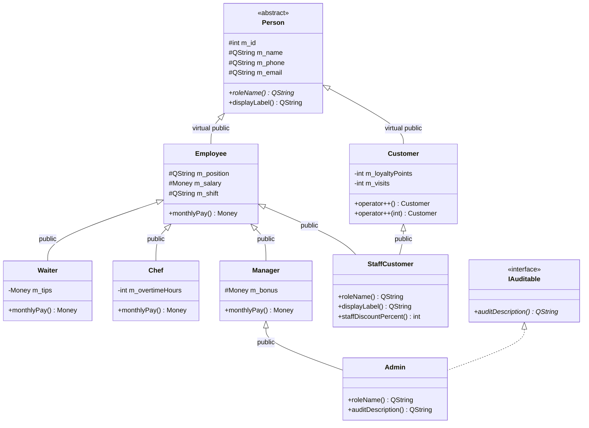
```mermaid
classDiagram
    direction TB

    class Person {
        <<abstract>>
        #int m_id
        #QString m_name
        #QString m_phone
        #QString m_email
        +roleName()* QString
        +displayLabel() QString
    }
    class Employee {
        #QString m_position
        #Money m_salary
        #QString m_shift
        +monthlyPay() Money
    }
    class Customer {
        -int m_loyaltyPoints
        -int m_visits
        +operator++() Customer
        +operator++(int) Customer
    }
    class Waiter {
        -Money m_tips
        +monthlyPay() Money
    }
    class Chef {
        -int m_overtimeHours
        +monthlyPay() Money
    }
    class Manager {
        #Money m_bonus
        +monthlyPay() Money
    }
    class Admin {
        +roleName() QString
        +auditDescription() QString
    }
    class StaffCustomer {
        +roleName() QString
        +displayLabel() QString
        +staffDiscountPercent() int
    }
    class IAuditable {
        <<interface>>
        +auditDescription()* QString
    }

    Person <|-- Employee : virtual public
    Person <|-- Customer : virtual public
    Employee <|-- Waiter : public
    Employee <|-- Chef : public
    Employee <|-- Manager : public
    Manager <|-- Admin : public
    IAuditable <|.. Admin
    Employee <|-- StaffCustomer : public
    Customer <|-- StaffCustomer : public
```

A waiter enrolled in the loyalty programme is **one human being** with one name, one phone number
and one id. Because `Employee` and `Customer` both derive `Person` *virtually*, `StaffCustomer`
carries exactly one `Person` subobject. Remove either `virtual` and `StaffCustomer.cpp` stops
compiling — `name()` becomes *"found in multiple base-class subobjects"*. `EmployeeService::staffCustomerFor()`
builds this fusion so that `BillingService` can ask a single object both *"are you on the
payroll?"* and *"what is your loyalty balance?"*.

---

## OOP concepts used

The full, greppable matrix — **concept → `file:line` → why it is natural there** — is in
**[`docs/OOP_COVERAGE.md`](docs/OOP_COVERAGE.md)**. Every site is also tagged in the source with a
Doxygen marker:

```cpp
/// @oop-concept Operator Overloading :: Order::operator+= IS the merge, expressed in code
```

Summary of where the syllabus lands, and why each site is real rather than a demo:

| Area | Where it lives | Why that is the natural home |
|---|---|---|
| **Encapsulation** | every model: private state, `const noexcept` observers, validating setters that throw `ValidationException` | invariants are enforced at the point of mutation, not by convention |
| **Abstract classes / pure virtual** | `Person::roleName()`, `Page`, `Command`, `ReportGenerator`, `Repository<T>::fromRecord` | nobody is "just a Person"; no page is "just a Page" |
| **Interfaces** | `IPrintable`, `ISerializable`, `IAuditable`, `IDiscountable` | capabilities orthogonal to identity |
| **Single inheritance** | `Manager : public Employee` | one base, its own pay policy |
| **Hierarchical** | `Waiter` / `Chef` / `Manager` over `Employee`; 9 pages over `Page`; 4 commands; 5 reports | one base, many real siblings |
| **Multilevel** | `Person → Employee → Manager → Admin` | four levels, each adding state |
| **Multiple** | `Admin : public Manager, public IAuditable`; `Bill : public IPrintable, public IDiscountable` | role + capability; document + discount target |
| **Hybrid** | `StaffCustomer : public Employee, public Customer` | multiple over a virtual/hierarchical structure |
| **Virtual base class** | `Employee : virtual public Person`, `Customer : virtual public Person` | one identity for a staff member who is also a guest |
| **Protected inheritance** | `ReportGenerator : protected persistence::CsvWriter` | a report is not a CSV writer, but derived reports must drive it |
| **Private inheritance** | `AuditTrail : private BinaryRecordFile` | raw `append` / `overwriteAt` must stay unreachable or the seq and checksum invariants can be broken |
| **Method overriding** | `monthlyPay()`, `roleName()` (`final` in `Admin`), `refresh()`, `fromRecord()` | payroll, labels, UI refresh, hydration |
| **Runtime polymorphism** | payroll over `vector<unique_ptr<Employee>>`; `CommandStack`; page `refresh()`; report export | concrete types chosen by a database string |
| **Compile-time polymorphism** | overloads (`Logger::log`, `Order::addItem`, `AuditService::log`) + templates | same verb, different arity |
| **Operator overloading** | `Money` `+ - * += -= *= == != < <= > >= <<`; `Order::operator+=` (merge), `operator[]`, `operator=`; `Customer::operator++` (prefix and postfix); `MenuItem::operator==` / `<`; `Bill::operator<<` | every one carries a domain meaning |
| **Friend function / class** | `operator<<` for `Money` and `Bill`; `Bill` friends `BillingService` | streaming needs internals; only the billing engine may settle a bill |
| **Static members** | `Order::s_openCount`, `Logger::s_messageCount`, `Database::instance()`, `ThemeManager::instance()` | process-wide state |
| **Constant objects / members** | `kAppInfo`, `kMenuCategories`, `Chef::kOvertimeRatePerHour`, `ThemeManager::kLight`/`kDark`; every observer is `const` | immutable identity and config |
| **Copy constructor / assignment** | `Order` — deep-copies the line vector, resets id and order number | that *is* the split-bill feature |
| **Destructor / RAII** | `Order` (counter), `BinaryRecordFile`, `CsvWriter`, `Logger` (flush + close) | resources genuinely need releasing |
| **Function templates** | `core::sumMoney`, `countMatching`, `clampValue` | one summation used by billing, dashboards, reports and payroll |
| **Class templates** | `Repository<T>`, `Result<T>` (+ a `Result<void>` specialisation) | the CRUD skeleton and the error carrier |
| **STL** | `vector` throughout, `std::map` in the ingredient plan and the settings cache, `std::queue` in `KitchenQueue`, `std::sort` / `find_if` / `remove_if`, explicit iterators in `sumMoney` | real containers doing real work |
| **File handling — append** | `Logger` — `std::ios::app` | every write lands at end of file |
| **File handling — binary + random access** | `BinaryRecordFile` — 128-byte fixed records with `seekg` / `seekp` to any index, plus an additive checksum | audit lookup by index without scanning |
| **File handling — ASCII + sequential** | `CsvWriter` — row by row, with cell escaping | report and backup exports |
| **File handling — error checking** | every `open` / `seek` / `read` / `write` / `flush` tests the stream state and throws `FileIOException`; `BackupManager` checks the SQLite header magic before a restore | a silent partial write is worse than a loud failure |
| **Exception hierarchy** | `AluChopException` → `Database`, `Validation`, `Auth`, `Inventory`, `FileIO` | one catchable base for the whole application |
| **Multiple catch** | `main.cpp` (four subtypes + `std::exception` + `...`); `OrderService::advanceStatus` (`InventoryException` vs `DatabaseException` — genuinely different recoveries) | different faults deserve different explanations |
| **Rethrow** | `Database::transaction` (roll back, then bare `throw;`), `AuditService::log`, `ReportGenerator::exportCsv` | a rollback or a failed audit write must never be swallowed |
| **Namespaces** | `aluchop::core / models / persistence / services / gui` | the layer map itself |

---

## Architecture

Five namespaces, **strictly one-way** dependencies. A layer may include the layers below it and
nothing above.

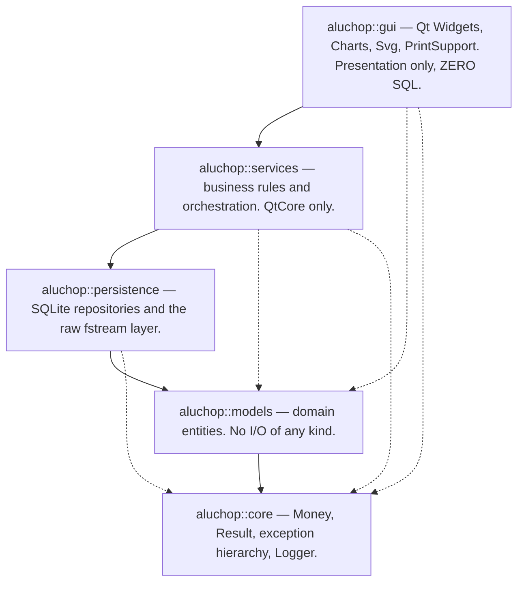
```mermaid
flowchart TD
    GUI["aluchop::gui — Qt Widgets, Charts, Svg, PrintSupport. Presentation only, ZERO SQL."]
    SVC["aluchop::services — business rules and orchestration. QtCore only."]
    PER["aluchop::persistence — SQLite repositories and the raw fstream layer."]
    MOD["aluchop::models — domain entities. No I/O of any kind."]
    COR["aluchop::core — Money, Result, exception hierarchy, Logger."]

    GUI --> SVC
    SVC --> PER
    PER --> MOD
    MOD --> COR
    GUI -.-> MOD
    GUI -.-> COR
    SVC -.-> MOD
    SVC -.-> COR
    PER -.-> COR
```

The rule is not aspirational — it is **greppable**, and both of these return nothing on the shipped
tree:

```bash
# No SQL may appear in the services layer.
grep -rnE 'QSqlQuery|QSqlDatabase|QSqlRecord|SELECT |INSERT |UPDATE |DELETE ' \
     src/services include/aluchop/services

# The GUI may not even NAME a persistence type. This is what
# "the GUI never touches the database" means, mechanically.
grep -rnE 'persistence::|aluchop/persistence/' src/gui include/aluchop/gui src/main.cpp
```

**Composition root.** `services::AppContext` owns every repository and every service as a *value
member* and hands out references. Its first member is a private `DbBootstrap` whose constructor
creates the data directory, opens SQLite and runs the migrations — because C++ initialises members
in declaration order, every repository declared after it can assume an open, migrated database.
`main.cpp` keeps the context in a `unique_ptr` in the frame that calls `app.exec()`, so it provably
outlives every window holding a reference to it.

**Notifications, not calls back up.** Services never know a GUI exists. They announce facts through
`NotificationService` — the only `QObject` service — and `MainWindow` subscribes. Adding a tenth
page requires no change to any service.

Full detail: [`docs/ARCHITECTURE.md`](docs/ARCHITECTURE.md) (the frozen contract) and
[`docs/CLASS_RELATIONSHIPS.md`](docs/CLASS_RELATIONSHIPS.md) (why each relationship is shaped the
way it is, including where the shipped code differs from the contract).

---

## Documentation

| Document | What is in it |
|---|---|
| [`SPEC.md`](SPEC.md) | The authoritative requirement specification |
| [`TOOLCHAIN.md`](TOOLCHAIN.md) | Verified toolchain, framework-build gotchas, single-file syntax check |
| [`docs/ARCHITECTURE.md`](docs/ARCHITECTURE.md) | The frozen design contract — file manifest and exact interfaces |
| [`docs/UML_CLASS_DIAGRAM.md`](docs/UML_CLASS_DIAGRAM.md) | Mermaid class diagrams, split by layer, plus the diamond |
| [`docs/CLASS_RELATIONSHIPS.md`](docs/CLASS_RELATIONSHIPS.md) | Prose: every significant relationship and why it is modelled that way |
| [`docs/FLOWCHART.md`](docs/FLOWCHART.md) | The order lifecycle, the status ladder, the inventory deduction |
| [`docs/USE_CASE.md`](docs/USE_CASE.md) | Actors, use cases, permission matrix, and what is actually enforced |
| [`docs/ER_DIAGRAM.md`](docs/ER_DIAGRAM.md) | The real SQLite schema: 17 tables, keys, cardinalities, indices |
| [`docs/OOP_COVERAGE.md`](docs/OOP_COVERAGE.md) | The syllabus matrix: concept → `file:line` → justification |

---

## Future improvements

Honest, in the order they would matter:

1. **Finish role enforcement.** `AuthService::hasRole()` and the `EmployeesPage` pattern (disable
   the control **and** re-check inside the slot) are in place, but today only account creation and
   staff management are gated. Sidebar entries should be filtered by role, and order cancellation,
   billing, menu CRUD, inventory and settings should each get the same treatment.
2. **Table occupancy as first-class state.** Seating a reservation marks it `SEATED` but does not
   open an order or mark the table busy; the waiter then creates the dine-in order manually. A
   `tables.occupied_by_order_id` column would close the loop and let the floor plan show live
   status.
3. **A visual floor plan.** Drag-arranged tables coloured by status would beat a reservations
   table for a real service.
4. **Wire up the unused counters.** `Order::openOrderCount()` and `Logger::messagesLogged()` are
   implemented but never called; a diagnostics panel is their natural home.
5. **Ship menu photography.** `menu_items.image_path` and the loading code exist; no artwork ships,
   so the field is empty for all 126 items.
6. **Multi-terminal operation.** The design is single-process and single-threaded by contract. A
   networked till would mean a server process and per-connection `QSqlDatabase` handles — a real
   change, not a tweak.
7. **Partial-payment splits.** Bills can be split *by line*; splitting a single bill across two
   tenders is not supported.
8. **Automated regression tests.** The `aluchop_e2e` CMake target exists for a headless
   order→kitchen→serve→bill→pay assertion; growing it into a suite with a CI runner is the obvious
   next step.
9. **Localisation.** The UI is English-only. Qt Linguist (`qttools` is already a dependency) would
   make a Nepali translation straightforward.

---

## Credits

<div align="center">

**Designed & Developed by**

### Shashank Bhattarai

**ACE082BCT078**

[shashankbhattarai006@gmail.com](mailto:shashankbhattarai006@gmail.com)

*ENCT151 — Object-Oriented Programming*

</div>

---

<div align="center">
<sub>

© 2026 AluChop Restaurant Management System. Developed by Shashank Bhattarai (ACE082BCT078).
For academic use as an ENCT151 Object-Oriented Programming coursework project. All rights reserved.

</sub>
</div>
