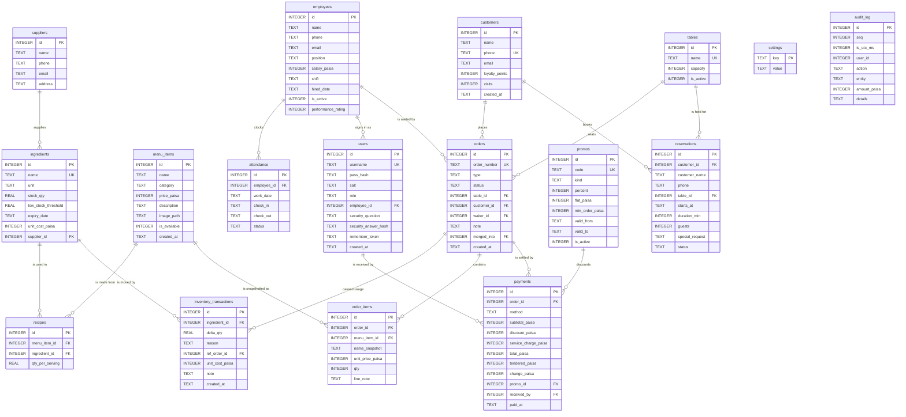

# AluChop — Entity–Relationship Diagram

> **Source of truth:** this diagram was transcribed from the real DDL in
> [`src/persistence/SchemaMigrator.cpp`](../src/persistence/SchemaMigrator.cpp) (`kMigration1`,
> 17 `CREATE TABLE` statements + 11 indices) and cross-checked against the live database at
> `~/Library/Application Support/AluChop/AluChop/aluchop.db`. No column here is invented.

**Conventions used by every table**

| Rule | Detail |
|---|---|
| Money | Always `INTEGER` **paisa** (100 paisa = Rs 1). Columns are suffixed `_paisa`. No `REAL` ever holds currency. |
| Quantities | `REAL` — these are physical measurements (kg, l, pcs), not money. |
| Timestamps | `TEXT`, ISO-8601 UTC, `yyyy-MM-ddTHH:mm:ss`. |
| Dates | `TEXT`, `yyyy-MM-dd`. |
| Booleans | `INTEGER` constrained to `IN (0,1)`. |
| Enums | `TEXT` with a `CHECK (... IN (...))` list whose tokens are exactly what `models::Enums.cpp` emits — an invalid enum becomes a database error, not silent bad data. |
| Foreign keys | Enforced: `Database::open()` runs `PRAGMA foreign_keys = ON` on the `aluchop_main` connection. |
| Prices | **Tax-inclusive.** There is no tax column anywhere, by design. |

---

## 1. The full schema

### One relationship deliberately omitted from the picture

`orders.merged_into` is a **self-referencing** foreign key
(`merged_into INTEGER REFERENCES orders(id) ON DELETE SET NULL`). It is left out of the Mermaid
graph only because a self-loop renders poorly; it is a real column and a real constraint.
`OrderService::mergeOrders()` sets it on the *source* order, which is then marked `CANCELLED`
rather than deleted — so the audit trail can always explain where a merged bill's lines came from.

---

## 2. Relationship catalogue

| Parent | Child | FK column | On delete | Cardinality | Meaning |
|---|---|---|---|---|---|
| `suppliers` | `ingredients` | `supplier_id` (nullable) | `SET NULL` | 0..1 → 0..* | Preferred supplier; losing a supplier must not lose the stock. |
| `menu_items` | `recipes` | `menu_item_id` | `CASCADE` | 1 → 0..* | A dish's bill of materials dies with the dish. |
| `ingredients` | `recipes` | `ingredient_id` | `CASCADE` | 1 → 0..* | The other half of the many-to-many. |
| `menu_items` ↔ `ingredients` | — | via `recipes` | — | *..* | Junction table with `UNIQUE (menu_item_id, ingredient_id)` and `CHECK (qty_per_serving > 0)`. |
| `employees` | `attendance` | `employee_id` | `CASCADE` | 1 → 0..* | `UNIQUE (employee_id, work_date)` — one row per person per day. |
| `employees` | `users` | `employee_id` (nullable) | `SET NULL` | 0..1 → 0..* | A login *may* be tied to a staff record; `0` means "no linked employee". |
| `tables` | `orders` | `table_id` (nullable) | `SET NULL` | 0..1 → 0..* | Only dine-in orders hold a table; takeaway/delivery store `0`/NULL. |
| `customers` | `orders` | `customer_id` (nullable) | `SET NULL` | 0..1 → 0..* | Walk-ins have no customer row. |
| `employees` | `orders` | `waiter_id` (nullable) | `SET NULL` | 0..1 → 0..* | Owning waiter, taken from the signed-in user's `employee_id`. |
| `orders` | `order_items` | `order_id` | `CASCADE` | 1 → 0..* | Lines belong to exactly one order. |
| `menu_items` | `order_items` | `menu_item_id` (nullable) | `SET NULL` | 0..1 → 0..* | **Deliberately nullable:** the line keeps `name_snapshot` and `unit_price_paisa`, so deleting a dish never rewrites history. |
| `orders` | `payments` | `order_id` | `CASCADE` | 1 → 0..* | Schema permits many; the business rule (`status != PAID` guard in `BillingService::settle`) allows only one. |
| `promos` | `payments` | `promo_id` (nullable) | `SET NULL` | 0..1 → 0..* | Which code, if any, produced the discount. |
| `users` | `payments` | `received_by` (nullable) | `SET NULL` | 0..1 → 0..* | Cashier accountability. |
| `tables` | `reservations` | `table_id` (**NOT NULL**) | `CASCADE` | 1 → 0..* | A booking without a table is meaningless. |
| `customers` | `reservations` | `customer_id` (nullable) | `SET NULL` | 0..1 → 0..* | Bookings also carry `customer_name`/`phone` so a non-enrolled guest can still book. |
| `ingredients` | `inventory_transactions` | `ingredient_id` | `CASCADE` | 1 → 0..* | Every stock movement. |
| `orders` | `inventory_transactions` | `ref_order_id` (nullable) | `SET NULL` | 0..1 → 0..* | Set when the movement was a `USAGE` draw caused by serving an order. |
| `orders` | `orders` | `merged_into` (nullable) | `SET NULL` | 0..1 → 0..* | Self-reference; see the note above. |

### Standalone tables

* **`settings`** — pure key/value store. Holds `schema_version`, `restaurant.name`,
  `restaurant.address`, `restaurant.phone`, `theme.mode` and `billing.service_charge_pct`.
  No foreign keys by design: it is configuration, not domain data.
* **`audit_log`** — the *queryable mirror* of the binary audit trail. It stores `user_id` as a
  plain `INTEGER` with **no** FK to `users`, on purpose: an audit record must survive the deletion
  of the account that produced it. The authoritative copy is the 128-byte fixed-record binary file
  `audit.bin` (`persistence::BinaryRecordFile` / `persistence::AuditTrail`); `AuditService::log()`
  writes the binary record first and the SQL mirror second.

---

## 3. Enumerated columns (the `CHECK` vocabularies)

These tokens are produced by `aluchop::models::toString(...)` and consumed by the matching
`...FromString(...)`, which throws `core::ValidationException` on anything unknown.

| Table.column | Allowed values |
|---|---|
| `employees.position` | `WAITER`, `CHEF`, `MANAGER`, `ADMIN` |
| `attendance.status` | `PRESENT`, `ABSENT`, `LEAVE` |
| `users.role` | `ADMIN`, `MANAGER`, `WAITER`, `CHEF` |
| `orders.type` | `DINE_IN`, `TAKEAWAY`, `DELIVERY` |
| `orders.status` | `OPEN`, `PENDING`, `PREPARING`, `READY`, `SERVED`, `PAID`, `CANCELLED` |
| `reservations.status` | `BOOKED`, `SEATED`, `COMPLETED`, `CANCELLED`, `NO_SHOW` |
| `promos.kind` | `PERCENT`, `FLAT` |
| `payments.method` | `CASH`, `CARD`, `WALLET` |
| `inventory_transactions.reason` | `RESTOCK`, `USAGE`, `WASTE`, `ADJUST` |

Additional range checks worth naming: `employees.performance_rating BETWEEN 1 AND 5`,
`promos.percent BETWEEN 0 AND 100`, `order_items.qty >= 1`, `tables.capacity >= 1`,
`reservations.duration_min >= 15`, `reservations.guests >= 1`, and `>= 0` on every `_paisa`,
`stock_qty` and `loyalty_points` column.

---

## 4. Indices

Created by the same migration, all `IF NOT EXISTS`:

| Index | Columns | Serves |
|---|---|---|
| `idx_orders_created` | `orders(created_at)` | date-range order reports |
| `idx_orders_status` | `orders(status)` | the kitchen board and active-order list |
| `idx_order_items_order` | `order_items(order_id)` | loading an order's lines |
| `idx_reservations_start` | `reservations(starts_at)` | the day view |
| `idx_reservations_table` | `reservations(table_id, starts_at)` | table-availability overlap probes |
| `idx_invtx_ingredient` | `inventory_transactions(ingredient_id, created_at)` | per-ingredient stock history |
| `idx_payments_paid_at` | `payments(paid_at)` | daily/weekly/monthly revenue |
| `idx_audit_ts` | `audit_log(ts_utc_ms)` | recent-activity queries |
| `idx_menu_category` | `menu_items(category, name)` | category browse, default sort |
| `idx_customers_phone` | `customers(phone)` | phone lookup at the till |
| `idx_attendance_emp` | `attendance(employee_id, work_date)` | monthly attendance sheet |

---

## 5. Migration and seeding

`SchemaMigrator` stores the shape of the database in `settings['schema_version']` (absent = 0) and
runs `applyMigration1()` + `seedIfEmpty()` inside **one** `Database::transaction`, so a failed
first launch leaves no half-built file. `kLatestVersion` is `1`. Shipped DDL is immutable — a
future change appends `applyMigration2()`, it never edits migration 1.

Seeding is guarded by `SELECT COUNT(*) FROM menu_items`, which makes it idempotent by construction
rather than by luck. A first run inserts:

| Data | Count | Source |
|---|---|---|
| Suppliers | 6 | `assets/menu/menu_seed.json` |
| Ingredients | 157 | `assets/menu/menu_seed.json` |
| Menu items | 126 (9 in each of the 14 categories) | `assets/menu/menu_seed.json` |
| Recipe lines | 580 | `recipe[]` inside each seed item |
| Tables | 12 (`T1`…`T12`, capacities 2/2/2/4/4/4/4/6/6/6/8/8) | hard-coded `std::array` |
| Employees | 7 (1 admin, 1 manager, 2 chefs, 3 waiters) | hard-coded `std::array` |
| Users | 1 (`admin`, salted SHA-256) | hard-coded |
| Customers | 6 | hard-coded `std::array` |
| Promos | 2 (`WELCOME10` 10 %, `FLAT100` Rs 100 off over Rs 1,000) | hard-coded |
| Settings | 5 defaults + `schema_version` | `_meta` block + hard-coded |

Prices arrive from the seed file as already-tax-inclusive paisa integers and are stored verbatim —
no code path in `SchemaMigrator.cpp` scales, taxes or rounds a price.

---

© 2026 AluChop Restaurant Management System. Developed by Shashank Bhattarai (ACE082BCT078).
For academic use as an ENCT151 Object-Oriented Programming coursework project. All rights reserved.
