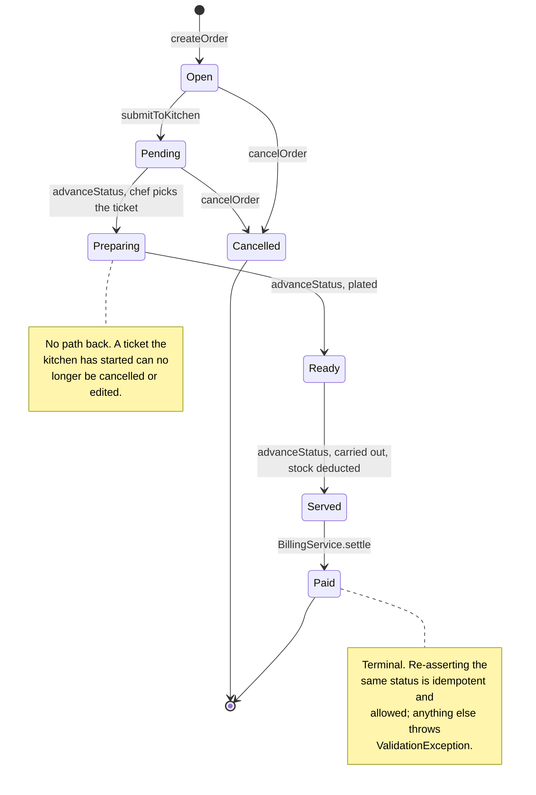
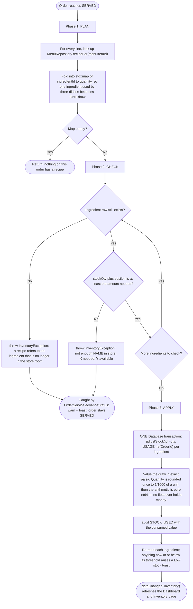

# AluChop — Order Lifecycle Flowchart

> Traced against the real implementations, not a design sketch:
> `services/ReservationService.cpp` · `services/OrderService.cpp` ·
> `services/InventoryService.cpp` · `services/BillingService.cpp` ·
> `models/Order.cpp` · `models/Bill.cpp` · `gui/OrdersPage.cpp` · `gui/BillingDialog.cpp`.
>
> Every decision diamond below is a branch that genuinely exists in the code, and every
> "rejected" edge is a real error path that returns a `core::Result::err(...)` or throws.

---

## 1. Seating → order → kitchen → serve → bill → payment → receipt

```mermaid
flowchart TD
    start(["Guest arrives"]) --> booked{"Has a reservation?"}

    booked -- Yes --> resv["ReservationsPage: pick the booking"]
    resv --> seat["ReservationService.seat()"]
    seat --> seatOk{"Status is BOOKED?"}
    seatOk -- No --> seatErr["Rejected: only a confirmed booking can be seated"]
    seatErr --> newOrder
    seatOk -- Yes --> seated["Reservation status becomes SEATED, audit RESV_SEAT"]
    seated --> newOrder

    booked -- No --> walkin["Walk-in, waiter picks a free table"]
    walkin --> newOrder

    newOrder["OrdersPage.onNewOrder: choose type, table, customer, note"]
    newOrder --> create["OrderService.createOrder(type, tableId, customerId, waiterId)"]
    create --> dineIn{"Order type is Dine-In?"}
    dineIn -- Yes --> tableOk{"Table exists AND is active AND id greater than 0?"}
    tableOk -- No --> tableErr["Rejected: a dine-in order needs a valid, in-service table"]
    tableErr --> newOrder
    tableOk -- Yes --> persist
    dineIn -- No --> noTable["Takeaway / Delivery: tableId forced to 0"]
    noTable --> persist

    persist["Row inserted, number ORD-YYYYMMDD-NNN assigned, status OPEN, audit ORDER_NEW"]
    persist --> addItem

    addItem["OrderService.addItem(orderId, menuItemId, qty)"]
    addItem --> qtyOk{"qty is at least 1?"}
    qtyOk -- No --> addErr["Rejected: quantity must be at least 1"]
    addErr --> addItem
    qtyOk -- Yes --> editable{"Status is OPEN or PENDING?"}
    editable -- No --> lockErr["Rejected: the kitchen has started this order, lines are frozen"]
    lockErr --> fire
    editable -- Yes --> dishOk{"Dish still on the menu AND marked available?"}
    dishOk -- No --> dishErr["Rejected: dish removed or switched off"]
    dishErr --> addItem
    dishOk -- Yes --> line["Line appended. Same menu item merges its qty into the existing line. Name and unit price are FROZEN on the line."]
    line --> more{"More items?"}
    more -- Yes --> addItem
    more -- No --> reshape{"Split or merge this ticket?"}

    reshape -- Split --> split["OrderService.splitOrder: Order copy constructor makes a new unsaved order, chosen lines move across, one transaction writes both"]
    split --> fire
    reshape -- Merge --> merge["OrderService.mergeOrders: target plus-equals source, source is CANCELLED and stamped merged_into"]
    merge --> fire
    reshape -- Neither --> fire

    fire["OrderService.submitToKitchen(orderId)"]
    fire --> notEmpty{"Order has at least one line?"}
    notEmpty -- No --> emptyErr["Rejected: an empty order cannot be sent to the kitchen"]
    emptyErr --> addItem
    notEmpty -- Yes --> pending["Status OPEN to PENDING, id pushed onto KitchenQueue, audit ORDER_FIRE"]

    pending --> prep["advanceStatus: PENDING to PREPARING, ticket popped off the queue"]
    prep --> ready["advanceStatus: PREPARING to READY, toast 'Order ready'"]
    ready --> served["advanceStatus: READY to SERVED"]

    served --> visit{"Order has a customer?"}
    visit -- Yes --> recordVisit["CustomerService.recordVisit: ++customer. Points are NOT credited here."]
    visit -- No --> deduct
    recordVisit --> deduct

    deduct["InventoryService.deductForOrder(order)"]
    deduct --> stockOk{"Every recipe ingredient exists AND has enough stock?"}
    stockOk -- No --> shortfall["InventoryException caught by OrderService: warning toast, stock flagged. The order STAYS SERVED, because the food already left the pass."]
    stockOk -- Yes --> drawn["One transaction writes one USAGE row per ingredient, stock decremented, audit STOCK_USED, low-stock toasts raised"]
    shortfall --> bill
    drawn --> bill

    bill["OrdersPage: Bill, opens BillingDialog"]
    bill --> prepare["BillingService.prepareBill(orderId, promoCode, serviceChargePct from settings)"]
    prepare --> billable{"Order is SERVED, not already PAID, and has lines?"}
    billable -- No --> billErr["Rejected: a bill is only raised once the food has gone out"]
    billErr --> served
    billable -- Yes --> snapshot["Bill snapshots the lines and the tax-inclusive subtotal"]

    snapshot --> discount{"Which discount wins?"}
    discount -- "Promo code entered and valid" --> promoOff["Discount = Promo.discountFor(subtotal)"]
    discount -- "Guest is also staff" --> staffOff["Discount = subtotal.percent(10)"]
    discount -- "Neither" --> noOff["Discount = zero"]
    promoOff --> compare
    staffOff --> compare
    noOff --> compare
    compare["Candidates COMPARED, never stacked. The larger wins; a tie keeps the promo the guest asked for."]

    compare --> svc["Service charge = subtotal.percent(pct), applied AFTER the discount"]
    svc --> total["total = subtotal - discount + serviceCharge. NO TAX IS EVER ADDED: menu prices are already tax-inclusive."]

    total --> method{"Tender type?"}
    method -- Cash --> tender{"tendered is at least total?"}
    tender -- No --> shortErr["Rejected: insufficient tender. changeFor() throws ValidationException, the Take payment button stays disabled."]
    shortErr --> method
    tender -- Yes --> change["change = tendered - total"]
    method -- "Card or Wallet" --> exact["tendered forced to total, change = zero"]

    change --> settle
    exact --> settle

    settle["BillingService.settle(orderId, bill, method, tendered, cashierUserId)"]
    settle --> txn["ONE transaction: insert the payments row, set order status to PAID, credit 1 loyalty point per Rs 100 paid"]
    txn --> friend["Bill.settle() runs AFTER the commit. It is private, and BillingService is its only friend, so this is the ONLY place a bill can become paid."]
    friend --> auditPaid["audit ORDER_PAID (binary trail + SQL mirror)"]
    auditPaid --> receipt["Bill.toPrintableText() via IPrintable"]
    receipt --> output{"How is it delivered?"}
    output -- "Print receipt" --> printer["PdfExporter.printReceipt: QPrinter dialog"]
    output -- "Save PDF" --> pdf["PdfExporter.receiptPdf: QPdfWriter into reports/"]
    printer --> done(["Table free, dashboard and inventory refresh via NotificationService.dataChanged"])
    pdf --> done
```

---

## 2. The status ladder is enforced in the model, not the UI

`Order::setStatus()` consults one transition table (`isLegalTransition` in `models/Order.cpp`) and
throws `core::ValidationException` on anything else. Keeping the rule in the model — rather than in
the GUI that happens to draw the buttons — is what makes it impossible for *any* code path,
present or future, to mark an order `PAID` straight from `OPEN`.

Transitions **not** in that table — `Open → Paid`, `Ready → Preparing`, `Paid → anything`,
`Cancelled → anything` — all throw. `from == to` is deliberately legal so a redundant write is a
no-op rather than a crash.

---

## 3. Recipe-driven inventory deduction — the three phases

`InventoryService::deductForOrder()` is plan → check → apply. It never half-deducts: either the
whole draw is possible and commits in one transaction, or nothing moves and an
`InventoryException` is thrown.

The epsilon (`1e-9`) is not fudging: without it, a draw of *exactly* the remaining stock would
intermittently look like an overdraw because of binary rounding on the `double` quantity.

---

## 4. Where the money is decided

One table, so the arithmetic can be checked at a glance. All figures are `core::Money`
(integer paisa) end to end.

| Step | Computation | Code |
|---|---|---|
| Line total | `unitPrice * qty` | `OrderItem::lineTotal()` |
| Subtotal | `core::sumMoney(items, lineTotal)` | `Order::subtotal()`, snapshotted into `Bill` |
| Promo discount | `PERCENT`: `subtotal.percent(pct)` · `FLAT`: `min(flatAmount, subtotal)` | `Promo::discountFor()` |
| Staff discount | `subtotal.percent(10)` | `StaffCustomer::staffDiscountPercent()` |
| Chosen discount | **max** of the candidates — never their sum; a tie keeps the promo | `BillingService::prepareBill()` |
| Service charge | `subtotal.percent(billing.service_charge_pct)`, default 10 %, applied **after** the discount | `Bill::setServiceCharge()` |
| **Total** | `subtotal − discount + serviceCharge` | `Bill::total()` |
| **Tax** | **none, ever** — menu prices are stored tax-inclusive | no code path adds tax |
| Change | `tendered − total`, Cash only; throws when short | `BillingService::changeFor()` |
| Loyalty | 1 point per whole Rs 100 of the amount actually paid | `pointsFor()` in `BillingService.cpp` |

Rounding for `Money::percent(pct)` is half-up on integer paisa, with sign care — there is no
floating-point step anywhere in the chain.

---

## 5. What each stage writes

| Stage | SQLite | Binary audit trail (`audit.bin`) | Notification |
|---|---|---|---|
| Order created | `orders` row, status `OPEN` | `ORDER_NEW` | `dataChanged("orders")` + toast |
| Line added / removed | `order_items` rewritten | — | `dataChanged("orders")` |
| Split | new `orders` row + updated original, one transaction | `ORDER_SPLIT` | toast |
| Merge | target updated, source `CANCELLED` + `merged_into` | `ORDER_MERGE` | toast |
| Fired to kitchen | `orders.status = PENDING` | `ORDER_FIRE` (with subtotal) | toast |
| Each kitchen step | `orders.status` | `ORDER_STEP` | `dataChanged("orders")` |
| Served | `inventory_transactions` (USAGE rows), `ingredients.stock_qty`, `customers.visits` | `STOCK_USED` | low-stock toasts, `dataChanged("inventory")` |
| Paid | `payments` row, `orders.status = PAID`, `customers.loyalty_points` — one transaction | `ORDER_PAID` (with total) | toast + three `dataChanged` domains |

Both audit destinations go through the single entry point `AuditService::log()`: the 128-byte
checksummed binary record is written **first** (it is the authoritative copy), the queryable
`audit_log` mirror second. A failure to write the trail is logged and then **re-thrown** with a
bare `throw;` — an audit write is never silently swallowed.

---

© 2026 AluChop Restaurant Management System. Developed by Shashank Bhattarai (ACE082BCT078).
For academic use as an ENCT151 Object-Oriented Programming coursework project. All rights reserved.
