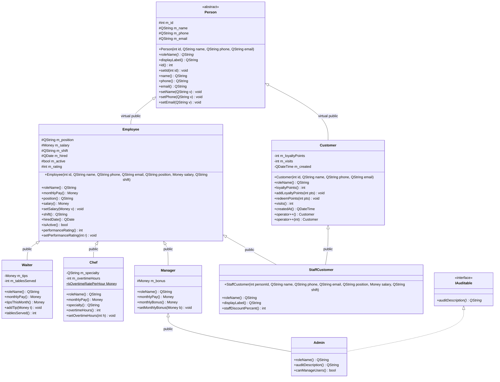
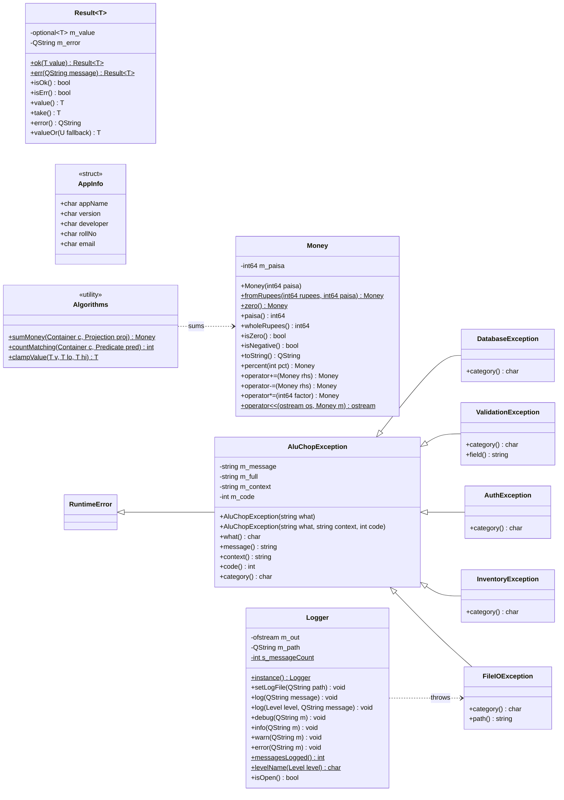
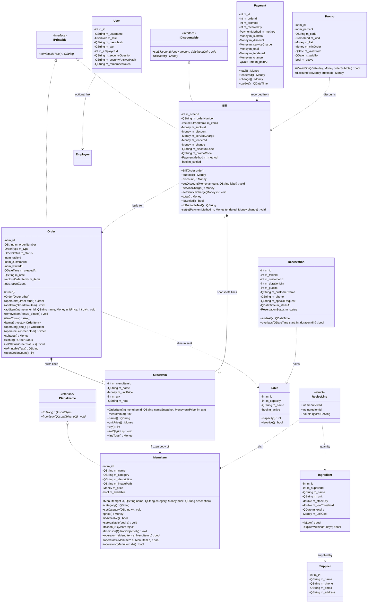
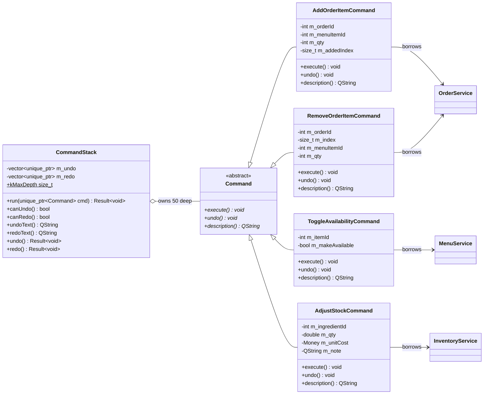
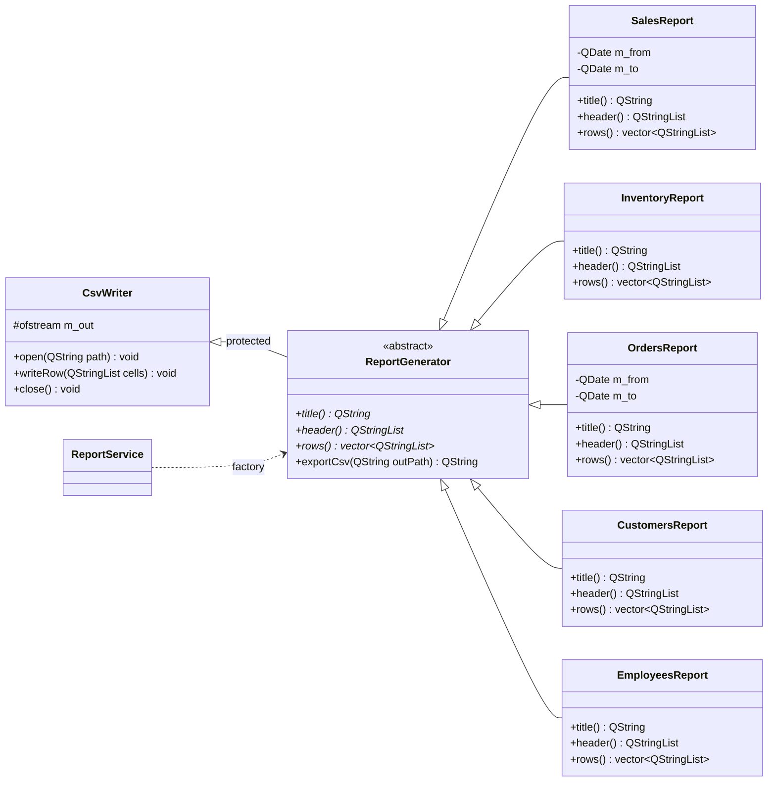
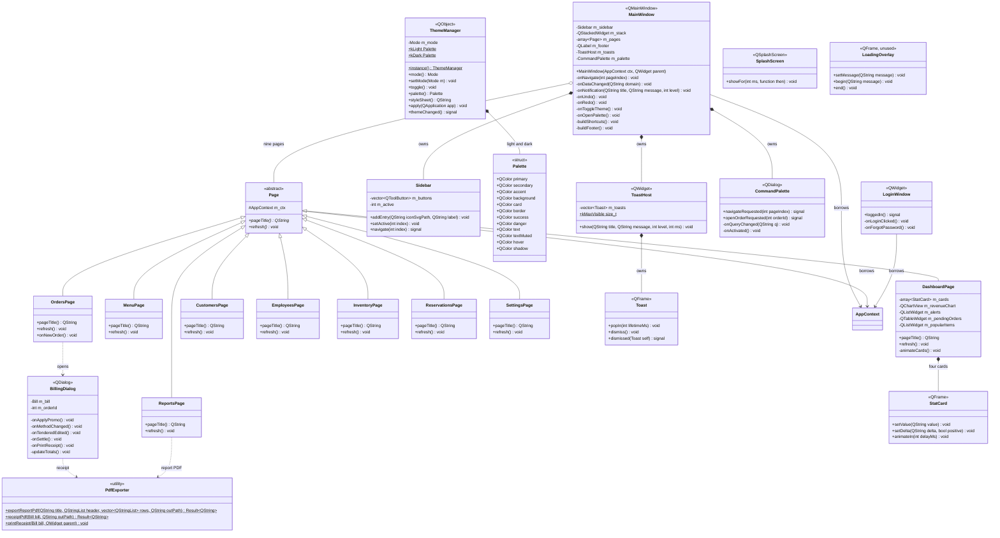
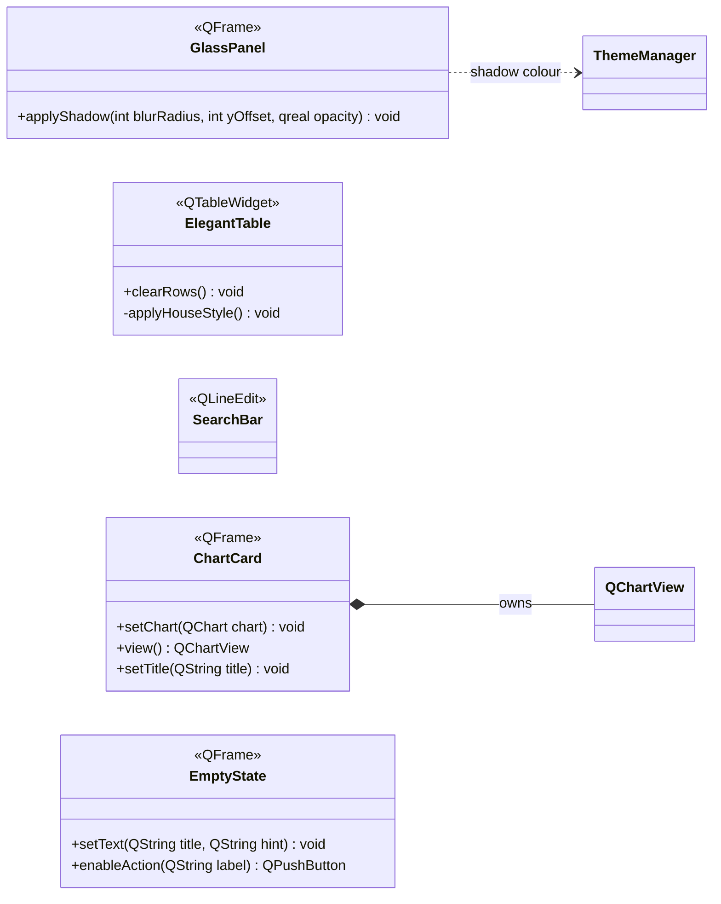
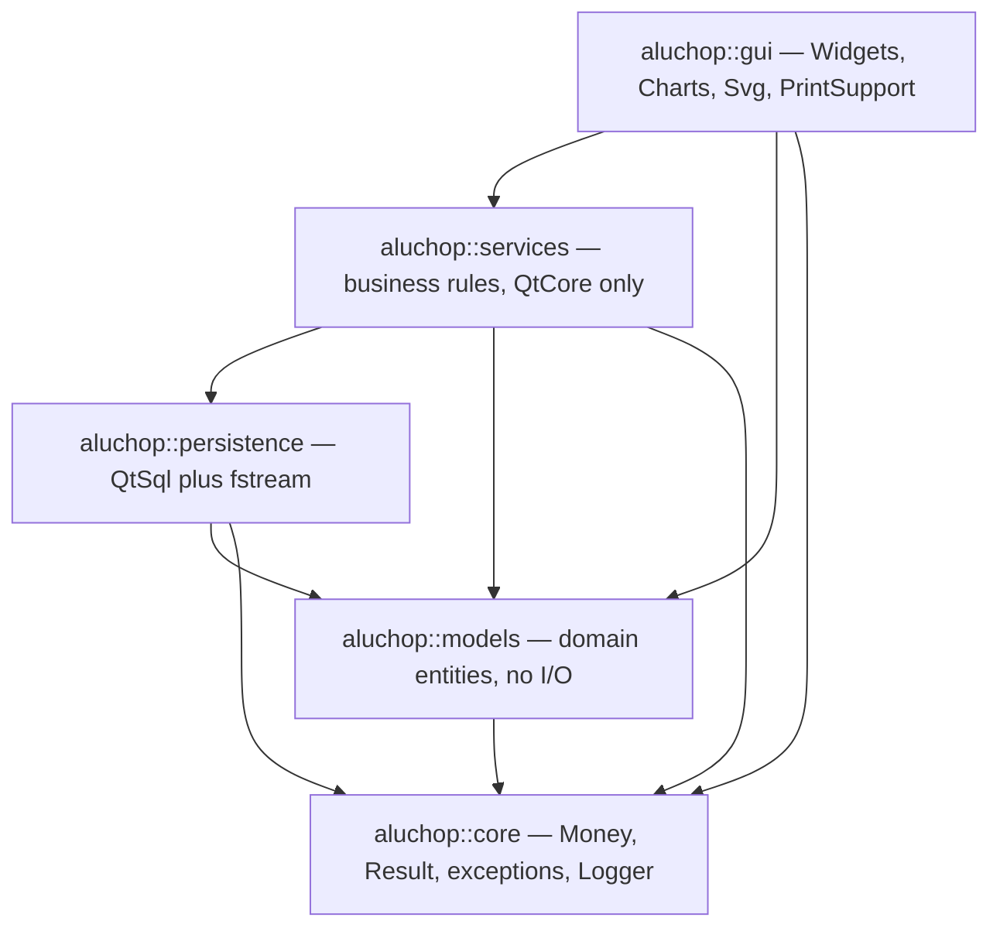

# AluChop — UML Class Diagrams

> Every class, member and arrow below was read out of the real headers in
> `include/aluchop/**` and the real definitions in `src/**`. Where the code and
> [`ARCHITECTURE.md`](ARCHITECTURE.md) disagree, **the code is what is drawn here.**
>
> The graph is ~70 classes across five namespaces, so it is split by layer. Diagram 1 is the
> centrepiece — the `Person` / `Employee` / `Customer` / `StaffCustomer` virtual-base diamond.
>
> Notation: `<|--` inheritance · `<|..` interface realisation · `*--` composition (owner destroys
> the part) · `o--` aggregation (holds, does not own) · `-->` association · `..>` dependency.
> Generic parameters are written `Type~T~` because that is Mermaid's syntax for `Type<T>`.

---

## 1. The people diamond — `aluchop::models`

This is the required *virtual base class* and it solves a real problem, not a contrived one.
A waiter who is also enrolled in the loyalty programme is **one human being** with one name, one
phone number and one id, who happens to appear in two database tables. `StaffCustomer` is that
person. Because `Employee` and `Customer` both derive `Person` **virtually**, the object carries
exactly one `Person` subobject: `setId(7)` is seen by both branches, and `name()` compiles.
Remove `virtual` from either edge and `StaffCustomer.cpp` stops compiling — `name()` becomes
*"found in multiple base-class subobjects"*.



**Which inheritance form lives where**

| Form | Site | Why it is genuine |
|---|---|---|
| Single | `Manager : public Employee` | one base, adds a bonus and its own pay policy |
| Hierarchical | `Waiter`, `Chef`, `Manager : public Employee` | three real siblings over one base |
| Multilevel | `Person → Employee → Manager → Admin` | every level adds state and behaviour |
| Multiple | `Admin : public Manager, public IAuditable` | a concrete role plus a capability mixin |
| Hybrid | `StaffCustomer : public Employee, public Customer` | multiple inheritance over a virtual/hierarchical structure |
| **Virtual base** | `Employee : virtual public Person`, `Customer : virtual public Person` | one identity for a staff member who is also a guest |
| Method overriding | `monthlyPay()` in Waiter/Chef/Manager; `roleName()` everywhere (`final` in `Admin`) | payroll and labels are honestly polymorphic |

`StaffCustomer::roleName()` is not decoration: `Employee::roleName()` and `Customer::roleName()`
are both final overriders of `Person::roleName()` along different paths, so the inherited overrider
is ambiguous. Declaring one in `StaffCustomer` is a **language requirement** for the class to be
instantiable at all.

---

## 2. `aluchop::core` — value types, errors, logging

Depends on QtCore and the standard library only. Nothing in this layer performs I/O except
`Logger`, which owns a `std::ofstream` in append mode.



`RuntimeError` in the diagram is `std::runtime_error`. `Money` is the only currency type in the
program: **no `double` ever holds money**, at any layer, not even in transit.

---

## 3. `aluchop::models` — the transactional domain



Three deliberate design points visible above:

* `OrderItem` freezes `name` **and** `unitPrice` at order time. Re-pricing the menu, or deleting a
  dish, can never rewrite a printed bill.
* `Bill::settle()` is **private** and `services::BillingService` is its only `friend`. That single
  line in `BillingService::settle()` is the only place in the whole application where a bill can
  become "paid", and it runs *after* the payment row commits.
* `Bill::total()` is `subtotal - discount + serviceCharge`. There is no tax term — anywhere.

---

## 4. `aluchop::persistence` — SQLite and the raw file layer

```mermaid
classDiagram
    direction TB

    class Database {
        -QString m_path
        -QSqlDatabase m_db
        +instance() Database$
        +open(QString dbFilePath) void
        +close() void
        +isOpen() bool
        +handle() QSqlDatabase
        +exec(QString sql) QSqlQuery
        +prepared(QString sql, QVariantList binds) QSqlQuery
        +transaction(function body) void
    }

    class SchemaMigrator {
        -Database m_db
        +kLatestVersion int$
        +migrate(QString menuSeedJsonPath) void
        +currentVersion() int
        -applyMigration1() void
        -seedIfEmpty(QString menuSeedJsonPath) void
    }

    class Repository~T~ {
        <<abstract>>
        #QString m_table
        +Repository(QString tableName)
        +findAll() vector~T~
        +findById(int id) optional~T~
        +count() int
        +removeById(int id) void
        #fromRecord(QSqlRecord rec)* T
        #orderByClause() QString
    }

    class UserRepository {
        +byUsername(QString username) optional~User~
        +byRememberToken(QString token) optional~User~
        +setRememberToken(int userId, QString token) void
        +setPassword(int userId, QString hash, QString salt) void
    }
    class MenuRepository {
        +byCategory(QString category) vector~MenuItem~
        +search(QString term) vector~MenuItem~
        +setAvailability(int itemId, bool available) void
        +recipeFor(int menuItemId) vector~RecipeLine~
        +setRecipe(int menuItemId, vector~RecipeLine~ lines) void
    }
    class CustomerRepository {
        +byPhone(QString phone) optional~Customer~
        +search(QString term) vector~Customer~
    }
    class EmployeeRepository {
        +makeTyped(int employeeId) unique_ptr~Employee~
        +allTyped() vector~unique_ptr~
        +markAttendance(int employeeId, QDate day, QString status, QTime in, QTime out) void
        +attendanceFor(int employeeId, int year, int month) vector~tuple~
    }
    class OrderRepository {
        +insertOrder(Order o) int
        +updateOrder(Order o) void
        +updateStatus(int orderId, OrderStatus s) void
        +loadOrder(int orderId) optional~Order~
        +withStatus(OrderStatus s) vector~Order~
        +activeOrders() vector~Order~
        +between(QDateTime from, QDateTime to) vector~Order~
        +forCustomer(int customerId, int limit) vector~Order~
        +markMergedInto(int sourceOrderId, int targetOrderId) void
    }
    class IngredientRepository {
        +adjustStock(int ingredientId, double deltaQty, QString reason, int refOrderId, Money unitCost, QString note) void
        +lowStock() vector~Ingredient~
        +expiringWithin(int days) vector~Ingredient~
        +history(int ingredientId, int limit) vector~tuple~
    }
    class SupplierRepository
    class TableRepository {
        +activeWithCapacityAtLeast(int guests) vector~Table~
    }
    class ReservationRepository {
        +setStatus(int reservationId, ReservationStatus s) void
        +onDay(QDate day) vector~Reservation~
        +overlapping(int tableId, QDateTime start, int durationMin) vector~Reservation~
    }
    class PaymentRepository {
        +between(QDateTime from, QDateTime to) vector~Payment~
        +revenueBetween(QDateTime from, QDateTime to) Money
        +popularItems(QDateTime from, QDateTime to, int topN) vector~pair~
    }
    class PromoRepository {
        +byCode(QString code) optional~Promo~
    }

    class SettingsRepository {
        +get(QString key, QString fallback) QString
        +set(QString key, QString value) void
        +remove(QString key) void
    }
    class AuditRepository {
        +insert(uint32 seq, int64 tsUtcMs, int userId, QString action, QString entity, Money amount, QString details) void
        +recent(int limit) vector~tuple~
    }

    class AuditRecord {
        <<struct>>
        +int64 timestampUtcMs
        +int64 amountPaisa
        +uint32 magic
        +uint32 seq
        +uint32 userId
        +char action_16
        +char entity_16
        +char details_64
        +uint32 checksum
    }

    class BinaryRecordFile {
        #fstream m_stream
        #QString m_path
        +openOrCreate() void
        +close() void
        +isOpen() bool
        +recordCount() size_t
        +append(AuditRecord rec) void
        +readAt(size_t index) AuditRecord
        +overwriteAt(size_t index, AuditRecord rec) void
        +checksumOf(AuditRecord rec) uint32$
        +fillString(char dest, size_t cap, QString src) void$
        #ensureOpen() void
    }

    class AuditTrail {
        -uint32 m_nextSeq
        +AuditTrail(QString path)
        +record(uint32 userId, QString action, QString entity, Money amount, QString details) uint32
        +at(size_t index) AuditRecord
        +tail(size_t n) vector~AuditRecord~
        +size() size_t
        +verifyIntegrity(size_t firstBadIndex) bool
    }

    class CsvWriter {
        #ofstream m_out
        #QString m_path
        #int m_rows
        +open(QString path) void
        +writeRow(QStringList cells) void
        +close() void
        +isOpen() bool
        +rowsWritten() int
        +escapeCell(QString cell) QString$
    }

    class BackupManager {
        -QString m_dbPath
        -QString m_backupDir
        +createBackup() QString
        +restoreBackup(QString backupFile) void
        +listBackups() vector~QString~
        +isValidSqliteFile(QString path) bool$
    }

    Repository~T~ <|-- UserRepository
    Repository~T~ <|-- MenuRepository
    Repository~T~ <|-- CustomerRepository
    Repository~T~ <|-- EmployeeRepository
    Repository~T~ <|-- OrderRepository
    Repository~T~ <|-- IngredientRepository
    Repository~T~ <|-- SupplierRepository
    Repository~T~ <|-- TableRepository
    Repository~T~ <|-- ReservationRepository
    Repository~T~ <|-- PaymentRepository
    Repository~T~ <|-- PromoRepository

    BinaryRecordFile <|-- AuditTrail : private
    BinaryRecordFile ..> AuditRecord : reads and writes
    Repository~T~ ..> Database : singleton
    SchemaMigrator --> Database : borrows
    SettingsRepository ..> Database : singleton
    AuditRepository ..> Database : singleton
```



`SettingsRepository` and `AuditRepository` deliberately do **not** derive `Repository<T>`: one has
no `id` column at all (`settings` is keyed by `key`), the other is an append-only log rather than
an entity store, so the generic `findAll` / `findById` / `removeById` skeleton buys them nothing.

---

## 5. `aluchop::services` — business rules and the composition root

```mermaid
classDiagram
    direction TB

    class AppContext {
        -DbBootstrap m_bootstrap
        -UserRepository m_userRepo
        -MenuRepository m_menuRepo
        -CustomerRepository m_customerRepo
        -EmployeeRepository m_employeeRepo
        -OrderRepository m_orderRepo
        -IngredientRepository m_ingredientRepo
        -SupplierRepository m_supplierRepo
        -TableRepository m_tableRepo
        -ReservationRepository m_reservationRepo
        -PaymentRepository m_paymentRepo
        -PromoRepository m_promoRepo
        -SettingsRepository m_settingsRepo
        -AuditRepository m_auditRepo
        -AuditTrail m_auditTrail
        -BackupManager m_backups
        +AppContext(QString dataDir, QString menuSeedJsonPath)
        +auth() AuthService
        +menu() MenuService
        +orders() OrderService
        +billing() BillingService
        +customers() CustomerService
        +employees() EmployeeService
        +inventory() InventoryService
        +reservations() ReservationService
        +reports() ReportService
        +settings() SettingsService
        +audit() AuditService
        +notifications() NotificationService
        +commands() CommandStack
    }

    class AuthService {
        +kMinPasswordLength int$
        +login(QString username, QString password, bool rememberMe) Result~User~
        +logout() void
        +currentUser() optional~User~
        +hasRole(UserRole atLeast) bool
        +tryRememberedLogin() optional~User~
        +changePassword(QString oldPassword, QString newPassword) Result~void~
        +securityQuestionFor(QString username) Result~QString~
        +resetPasswordWithAnswer(QString username, QString answer, QString newPassword) Result~void~
        +createUser(QString username, QString password, UserRole role, int employeeId, QString q, QString a) Result~int~
        +hashPassword(QString password, QString salt) QString$
        +generateSalt() QString$
    }

    class OrderService {
        -KitchenQueue m_queue
        +createOrder(OrderType type, int tableId, int customerId, int waiterId) Result~Order~
        +addItem(int orderId, int menuItemId, int qty) Result~void~
        +updateItemQty(int orderId, size_t index, int qty) Result~void~
        +removeItem(int orderId, size_t index) Result~void~
        +cancelOrder(int orderId) Result~void~
        +splitOrder(int orderId, vector~size_t~ itemIndexes) Result~Order~
        +mergeOrders(int targetOrderId, int sourceOrderId) Result~void~
        +submitToKitchen(int orderId) Result~void~
        +advanceStatus(int orderId) Result~void~
        +activeOrders() vector~Order~
        +kitchenQueue() KitchenQueue
        +rebuildQueue() void
    }

    class KitchenQueue {
        -queue~int~ m_q
        +push(int orderId) void
        +front() int
        +pop() void
        +empty() bool
        +size() size_t
        +snapshot() vector~int~
        +remove(int orderId) void
    }

    class BillingService {
        +prepareBill(int orderId, QString promoCode, int serviceChargePercent) Result~Bill~
        +settle(int orderId, Bill bill, PaymentMethod method, Money tendered, int cashierUserId) Result~Payment~
        +changeFor(Money total, Money tendered) Money
        +receiptText(Bill bill) QString
    }

    class InventoryService {
        +all() vector~Ingredient~
        +addIngredient(Ingredient i) Result~int~
        +restock(int ingredientId, double qty, Money unitCost, QString note) Result~void~
        +recordWaste(int ingredientId, double qty, QString note) Result~void~
        +deductForOrder(Order order) void
        +lowStock() vector~Ingredient~
        +expiring(int days) vector~Ingredient~
        +suppliers() vector~Supplier~
    }

    class MenuService {
        +all() vector~MenuItem~
        +search(QString term, QString category, bool availableOnly, MenuSort sort) vector~MenuItem~
        +categories() vector~QString~
        +create(MenuItem item) Result~int~
        +setAvailability(int itemId, bool available) Result~void~
        +recipeFor(int menuItemId) vector~RecipeLine~
        +setRecipe(int menuItemId, vector~RecipeLine~ lines) Result~void~
    }

    class CustomerService {
        +search(QString term) vector~Customer~
        +create(QString name, QString phone, QString email) Result~int~
        +recordVisit(int customerId, Money spent) Result~void~
        +redeemPoints(int customerId, int points) Result~void~
        +visitHistory(int customerId, int limit) vector~Order~
        +favouriteItems(int customerId, int topN) vector~QString~
    }

    class EmployeeService {
        +staff() vector~unique_ptr~
        +hire(QString name, QString phone, QString email, QString position, Money salary, QString shift) Result~int~
        +deactivate(int employeeId) Result~void~
        +markAttendance(int employeeId, QDate day, QString status, QTime in, QTime out) Result~void~
        +payrollPreview() vector~tuple~
        +staffCustomerFor(int customerId) optional~StaffCustomer~
    }

    class ReservationService {
        +availableTables(QDateTime start, int durationMin, int guests) vector~Table~
        +book(Reservation r) Result~int~
        +cancel(int reservationId) Result~void~
        +seat(int reservationId) Result~void~
        +complete(int reservationId) Result~void~
        +onDay(QDate day) vector~Reservation~
    }

    class ReportService {
        +salesForDay(QDate day) Money
        +weeklySales(QDate weekEnding) array~Money~
        +salesForMonth(int year, int month) Money
        +popularItems(int topN) vector~pair~
        +revenueSeries(QDate from, QDate to) vector~pair~
        +customerCount() int
        +pendingOrderCount() int
        +makeReport(ReportKind kind, QDate from, QDate to) unique_ptr~ReportGenerator~
    }

    class SettingsService {
        -map~QString~ m_cache
        +get(QString key, QString fallback) QString
        +set(QString key, QString value) void
        +createBackup() Result~QString~
        +restoreBackup(QString path) Result~void~
        +listBackups() vector~QString~
    }

    class AuditService {
        -int m_activeUserId
        +setActiveUser(int userId) void
        +log(QString action, QString entity) void
        +log(QString action, QString entity, Money amount, QString details) void
        +verifyTrailIntegrity(size_t firstBadIndex) bool
        +trailRecordCount() size_t
        +recentTrailRecords(size_t n) vector~AuditRecord~
    }

    class NotificationService {
        <<QObject>>
        +notify(QString title, QString message, int level) void
        +announceDataChanged(QString domain) void
        +notification(QString title, QString message, int level) signal
        +dataChanged(QString domain) signal
    }

    AppContext *-- AuthService : owns by value
    AppContext *-- MenuService : owns by value
    AppContext *-- OrderService : owns by value
    AppContext *-- BillingService : owns by value
    AppContext *-- CustomerService : owns by value
    AppContext *-- EmployeeService : owns by value
    AppContext *-- InventoryService : owns by value
    AppContext *-- ReservationService : owns by value
    AppContext *-- ReportService : owns by value
    AppContext *-- SettingsService : owns by value
    AppContext *-- AuditService : owns by value
    AppContext *-- NotificationService : owns by value
    OrderService *-- KitchenQueue : owns
    OrderService --> InventoryService : deducts on serve
    OrderService --> CustomerService : records visit
    BillingService --> CustomerService : awards points
    BillingService --> EmployeeService : staff discount
    InventoryService --> MenuRepository : reads recipes
    AuthService --> AuditService : logs
```



### Undo/redo — the Command hierarchy



### Reports — protected inheritance of the CSV writer



---

## 6. `aluchop::gui` — Qt Widgets presentation

Every class here carries `Q_OBJECT`. **No GUI translation unit names an `aluchop::persistence`
type or contains a line of SQL** — that is what makes "the GUI never touches the database"
mechanically checkable rather than a promise.



### Reusable widget vocabulary — `gui/Widgets.hpp`

A header-only set of house-styled widgets shared by every page. *(Not listed in the frozen
`ARCHITECTURE.md` file manifest — it was added during implementation; see the drift note in the
README.)*



---

## 7. Cross-layer dependency rule



Two greppable rules enforce it, and both come back empty on the shipped tree:

```bash
# no SQL in the services layer
grep -rnE 'QSqlQuery|QSqlDatabase|QSqlRecord|SELECT |INSERT |UPDATE |DELETE ' \
     src/services include/aluchop/services

# no persistence type ever named by the GUI
grep -rnE 'persistence::|aluchop/persistence/' src/gui include/aluchop/gui src/main.cpp
```

---

<sub>© 2026 AluChop Restaurant Management System. Developed by Shashank Bhattarai (ACE082BCT078).
For academic use as an ENCT151 Object-Oriented Programming coursework project. All rights reserved.</sub>
