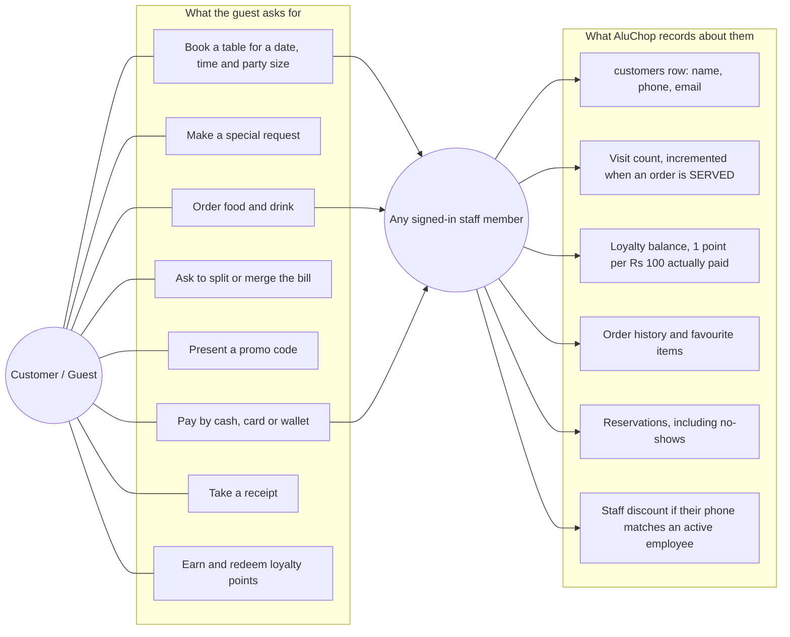

# AluChop — Use-Case Model

> **Read this first.** The diagrams below describe the *designed* role model, which is what
> `models::UserRole` and `services::AuthService::hasRole()` express. Section 5 states plainly and
> without varnish which of those permissions the shipped build actually **enforces in code** and
> which are, today, convention rather than a locked door. Nothing here claims a gate that does not
> exist.

---

## 1. Actors

| Actor | Is it a login? | Where it comes from |
|---|---|---|
| **Admin** | Yes — `UserRole::Admin`, rank 3 | Seeded account `admin`; the only role that may create further login accounts |
| **Manager** | Yes — `UserRole::Manager`, rank 2 | `users.role = 'MANAGER'` |
| **Waiter** | Yes — `UserRole::Waiter`, rank 1 | `users.role = 'WAITER'` |
| **Chef** | Yes — `UserRole::Chef`, rank 1 | `users.role = 'CHEF'` |
| **Customer / Guest** | **No** | A `customers` row, not an account. There is no customer-facing login — the guest is a *human* actor served by staff, and the system records them. |

Rank comes from `rankOf()` in `services/AuthService.cpp`. `hasRole(atLeast)` is a
**greater-than-or-equal** test on that rank, so Admin satisfies every check, Manager satisfies
Manager/Waiter/Chef checks, and Waiter and Chef sit at the same rank (1) — neither outranks the
other.

---

## 2. Use-case diagram — staff-facing

```mermaid
flowchart LR
    admin(("Admin"))
    manager(("Manager"))
    waiter(("Waiter"))
    chef(("Chef"))

    subgraph AUTH["Authentication"]
        uc1["Log in"]
        uc2["Log out"]
        uc3["Remember me on this device"]
        uc4["Reset password via security question"]
        uc5["Change own password"]
        uc6["Create a login account"]
    end

    subgraph OPS["Floor operations"]
        uc7["Open an order: Dine-In, Takeaway or Delivery"]
        uc8["Add, edit and remove order lines"]
        uc9["Split a bill"]
        uc10["Merge two bills"]
        uc11["Fire the ticket to the kitchen"]
        uc12["Cancel an order"]
    end

    subgraph KITCHEN["Kitchen"]
        uc13["Watch the kitchen queue"]
        uc14["Advance Pending to Preparing"]
        uc15["Advance Preparing to Ready"]
        uc16["Advance Ready to Served"]
        uc17["Toggle a dish available or unavailable"]
    end

    subgraph MONEY["Billing"]
        uc18["Prepare a bill"]
        uc19["Apply a promo code"]
        uc20["Take payment: Cash, Card or Wallet"]
        uc21["Give change"]
        uc22["Print or save the receipt"]
    end

    subgraph BOOK["Books and back office"]
        uc23["Browse, search, sort and filter the menu"]
        uc24["Create, edit and delete menu items"]
        uc25["Edit a dish recipe"]
        uc26["Manage the customer database"]
        uc27["Manage staff, attendance and payroll"]
        uc28["Manage stock, suppliers, restock and waste"]
        uc29["Take and manage reservations"]
        uc30["Run reports and export CSV or PDF"]
        uc31["Verify the audit trail integrity"]
        uc32["Back up, restore and export the database"]
        uc33["Edit restaurant info and switch theme"]
    end

    admin --- uc6
    admin --- uc27
    admin --- uc32
    admin --- uc33
    admin --- uc31

    manager --- uc24
    manager --- uc25
    manager --- uc27
    manager --- uc28
    manager --- uc30
    manager --- uc31
    manager --- uc32
    manager --- uc33
    manager --- uc12

    waiter --- uc7
    waiter --- uc8
    waiter --- uc9
    waiter --- uc10
    waiter --- uc11
    waiter --- uc16
    waiter --- uc18
    waiter --- uc19
    waiter --- uc20
    waiter --- uc21
    waiter --- uc22
    waiter --- uc23
    waiter --- uc26
    waiter --- uc29

    chef --- uc13
    chef --- uc14
    chef --- uc15
    chef --- uc17

    admin --- uc1
    manager --- uc1
    waiter --- uc1
    chef --- uc1
    admin --- uc2
    manager --- uc2
    waiter --- uc2
    chef --- uc2
    waiter --- uc3
    waiter --- uc4
    waiter --- uc5
```

---

## 3. Use-case diagram — the guest

The guest never touches the application. They are a real-world actor whose requests staff satisfy,
and whose record the system keeps. This is drawn separately because mixing a non-system actor into
the permission graph above would misrepresent what the software enforces.

Note `r6`: `EmployeeService::staffCustomerFor()` fuses a `customers` row and an active `employees`
row **by normalised phone number** into a single `models::StaffCustomer`. That fused object — one
`Person` subobject serving both branches of the virtual-base diamond — is what lets
`BillingService` ask one object both *"are you on the payroll?"* and *"what is your loyalty
balance?"*.

---

## 4. Permission matrix — the design

`✔` = intended for this role · `—` = not intended.

| Use case | Admin | Manager | Waiter | Chef | Guest |
|---|:--:|:--:|:--:|:--:|:--:|
| Log in / log out | ✔ | ✔ | ✔ | ✔ | — |
| Remember me, forgot password, change own password | ✔ | ✔ | ✔ | ✔ | — |
| **Create a login account** | ✔ | — | — | — | — |
| View dashboard | ✔ | ✔ | ✔ | ✔ | — |
| Browse / search / sort / filter the menu | ✔ | ✔ | ✔ | ✔ | — |
| Create / edit / delete a menu item | ✔ | ✔ | — | — | — |
| Edit a dish recipe | ✔ | ✔ | — | — | — |
| Toggle dish availability | ✔ | ✔ | ✔ | ✔ | — |
| Open / edit an order | ✔ | ✔ | ✔ | — | — |
| Split / merge bills | ✔ | ✔ | ✔ | — | — |
| Fire ticket to kitchen | ✔ | ✔ | ✔ | — | — |
| Advance kitchen status | ✔ | ✔ | ✔ | ✔ | — |
| Cancel an order | ✔ | ✔ | — | — | — |
| Prepare a bill, apply a promo | ✔ | ✔ | ✔ | — | — |
| Take payment and give change | ✔ | ✔ | ✔ | — | — |
| Print / save a receipt | ✔ | ✔ | ✔ | — | — |
| Manage customers | ✔ | ✔ | ✔ | — | — |
| **Hire / edit / deactivate staff** | ✔ | ✔ | — | — | — |
| **Mark attendance, view payroll** | ✔ | ✔ | — | — | — |
| Manage stock, suppliers, restock, waste | ✔ | ✔ | — | — | — |
| Take / seat / cancel reservations | ✔ | ✔ | ✔ | — | — |
| Run reports, export CSV / PDF | ✔ | ✔ | — | — | — |
| Verify audit-trail integrity | ✔ | ✔ | — | — | — |
| Backup / restore / export the database | ✔ | ✔ | — | — | — |
| Restaurant info, theme, settings | ✔ | ✔ | — | — | — |

---

## 5. Honest note — what is actually enforced in code

The matrix above is the design. The build that ships enforces **two** of those gates
mechanically. Everything else is currently reachable by any authenticated user.

| Gate | Where | Effect |
|---|---|---|
| **Admin only** — create a login account | `AuthService::createUser()`, `src/services/AuthService.cpp:366` | Throws `core::AuthException` unless `hasRole(UserRole::Admin)`. Deliberately placed in the **service**, so no future GUI page, test or CLI can create an account by simply not asking. |
| **Manager or above** — staff management | `EmployeesPage`, `src/gui/EmployeesPage.cpp:512, 765, 847, 963, 1006` | Below Manager the Employees screen degrades to a **read-only roster**: Hire / Edit / Deactivate / Mark-attendance buttons are disabled, and each of the four slots re-checks the rank before acting even if a button were somehow triggered. |

**Not enforced today:** sidebar navigation is not filtered by role — a signed-in Chef can open the
Reports or Settings page; order cancellation, billing, menu CRUD, inventory and reservations are
not rank-gated. The infrastructure to close this is already in place (`AuthService::hasRole()` and
the `EmployeesPage` pattern of *disable the control **and** re-check inside the slot*); extending
it to the other pages is listed as a future improvement in the README, not claimed as done.

The signed-in user's role **is** live and visible: `MainWindow` shows
`username · ROLE` in the shell header, `AuditService::setActiveUser()` stamps the acting user id
onto every audit record, and `payments.received_by` records which account took the money.

---

## 6. Principal use-case specifications

### UC-07 · Open an order

| | |
|---|---|
| **Primary actor** | Waiter |
| **Precondition** | Signed in; for Dine-In, a table exists and `is_active = 1` |
| **Main flow** | Orders → *New order* → choose type / table / customer / note → `OrderService::createOrder()` → row inserted with `ORD-YYYYMMDD-NNN` and status `OPEN` → audit `ORDER_NEW` |
| **Alternate** | Takeaway or Delivery: `tableId` is forced to `0` and no table is checked |
| **Exceptions** | Dine-In with no table → *"A dine-in order needs a table."* · unknown table → *"Table N does not exist."* · out-of-service table → *"Table X is out of service."* |
| **Postcondition** | An editable order exists, ready for lines |

### UC-11 · Fire the ticket to the kitchen

| | |
|---|---|
| **Primary actor** | Waiter |
| **Precondition** | Order is `OPEN` (or already `PENDING`) and has at least one line |
| **Main flow** | `OrderService::submitToKitchen()` → `Order::setStatus(Pending)` validates the ladder → status persisted → id pushed onto `KitchenQueue` → audit `ORDER_FIRE` with the subtotal → toast *"Ticket fired"* |
| **Exceptions** | Empty order → *"An empty order cannot be sent to the kitchen."* · illegal transition → `ValidationException` surfaced as an error toast |

### UC-16 · Advance Ready → Served (the inventory trigger)

| | |
|---|---|
| **Primary actor** | Waiter |
| **Precondition** | Order is `READY` |
| **Main flow** | `advanceStatus()` → status `SERVED` → visit recorded (`++customer`, **no points yet**) → `InventoryService::deductForOrder()` folds every recipe into one draw per ingredient and commits them in a single transaction → audit `STOCK_USED` → low-stock toasts |
| **Exception (important)** | A stock shortfall throws `InventoryException`, which `advanceStatus` catches **separately** from `DatabaseException`: the food has already left the pass, so the order **stays `SERVED`**, a loud warning is raised, and the discrepancy becomes a stock-keeping problem — the system does not pretend the plate came back |

### UC-20 · Take payment

| | |
|---|---|
| **Primary actor** | Waiter (acting as cashier) |
| **Precondition** | Order is `SERVED`, not already `PAID`, and has lines |
| **Main flow** | `prepareBill()` snapshots the lines and subtotal → best discount chosen (promo vs staff, **compared, never stacked**) → service charge applied after the discount → `total = subtotal − discount + serviceCharge` → `settle()` runs one transaction inserting the `payments` row, setting `orders.status = PAID` and crediting loyalty → `Bill::settle()` (private, `BillingService` is its only friend) marks the bill paid **after** the commit → audit `ORDER_PAID` |
| **Exceptions** | Cash short → *"Insufficient tender: X does not cover Y."* (the *Take payment* button is disabled until the tender covers the total) · order not served → *"… has not been served yet."* · already settled → *"… has already been settled."* |
| **Postcondition** | Receipt available as text, print job or PDF; three `dataChanged` domains refresh the shell |

### UC-04 · Reset password via security question

| | |
|---|---|
| **Primary actor** | Any staff member |
| **Main flow** | Login → *Forgot password* → enter username → `securityQuestionFor()` returns the stored prompt → answer + new password → `resetPasswordWithAnswer()` compares `SHA-256(salt + answer)` and writes a **new** `pass_hash` |
| **Notes** | Plaintext is never stored, at any point. The seeded `admin` question is *"What is your roll number?"* with the answer `ACE082BCT078`. |

---

© 2026 AluChop Restaurant Management System. Developed by Shashank Bhattarai (ACE082BCT078).
For academic use as an ENCT151 Object-Oriented Programming coursework project. All rights reserved.
